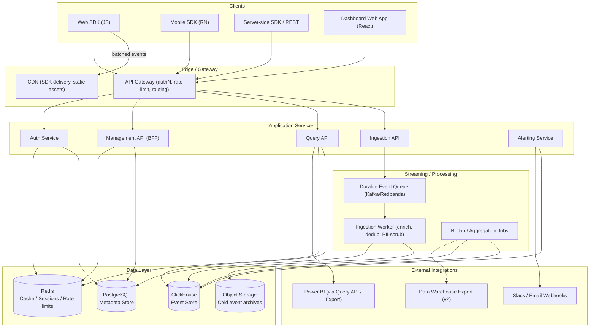
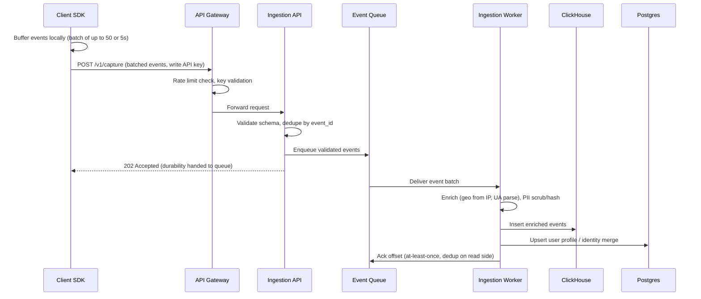
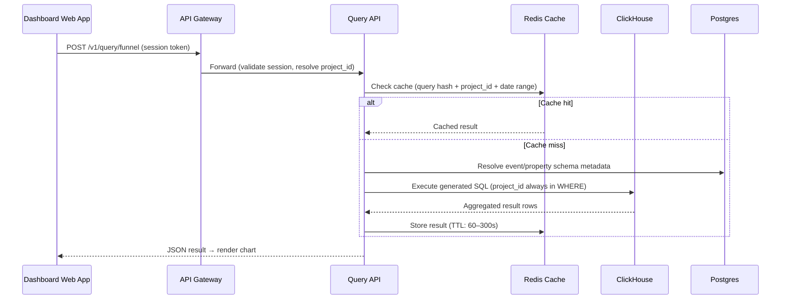
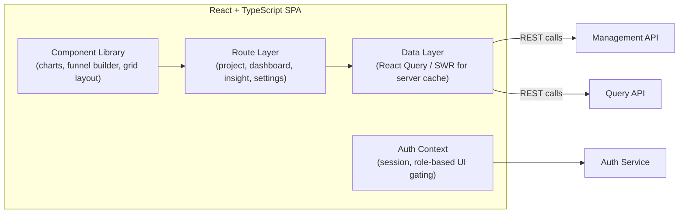
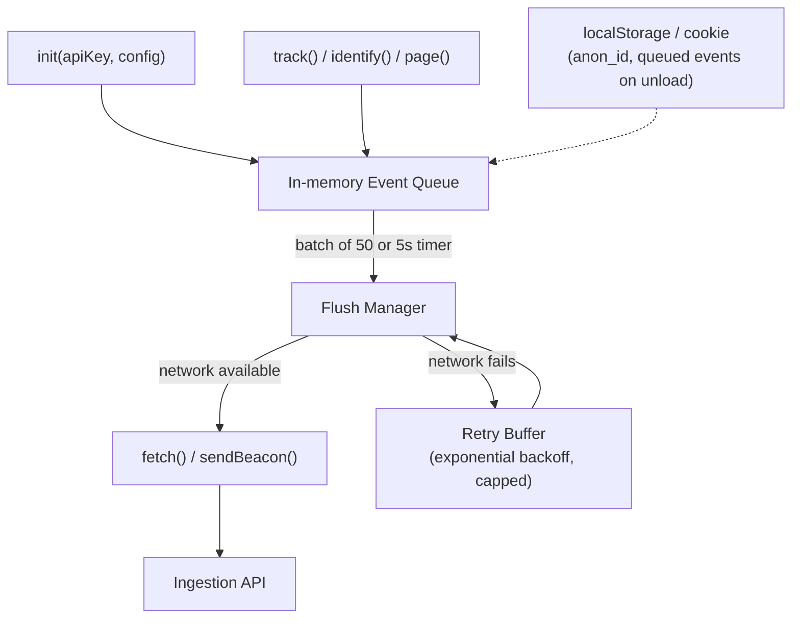
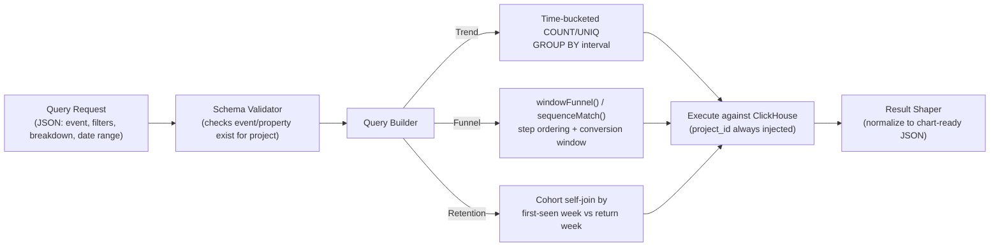
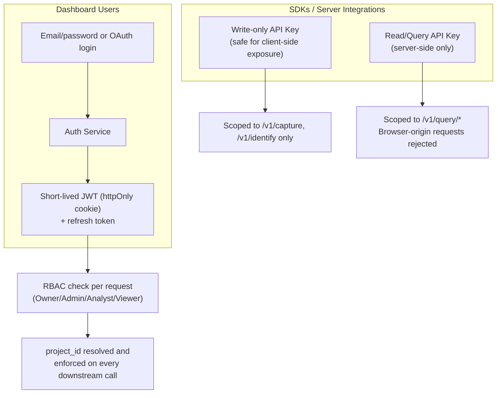
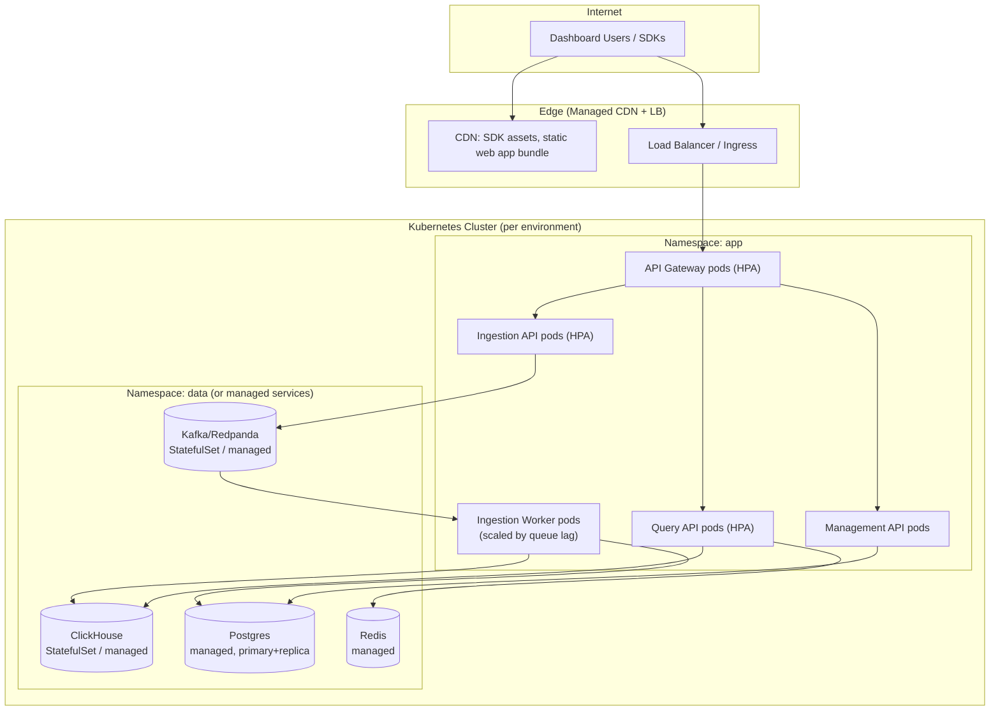
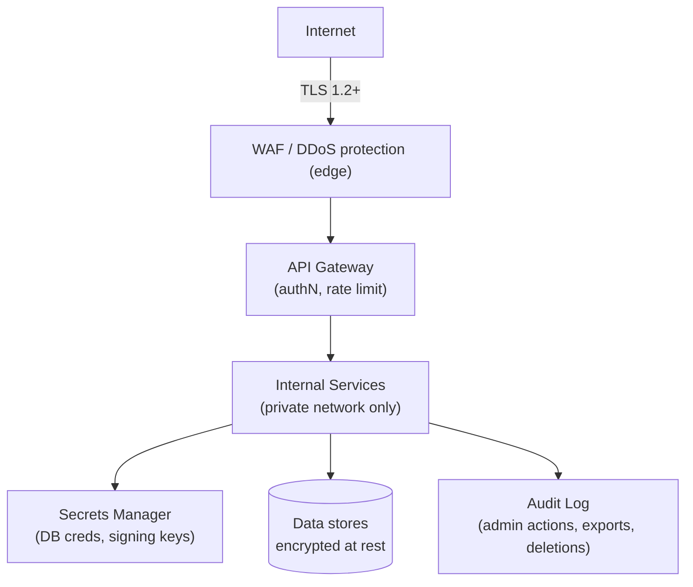

# InsightFuel — Software Architecture Document

**Companion to:** InsightFuel-PRD.md
**Audience:** Engineering team (backend, frontend, DevOps, security)
**Status:** Draft v1.0
**Scale target:** Thousands of concurrent dashboard users; hundreds of tracked applications/projects; tens of millions of events/day sustained, bursting higher.

---

## 1. Architecture Principles

1. **Decouple the write path from everything else.** Event ingestion must never be slowed down by query load, dashboard rendering, or downstream processing.
2. **Stateless where possible.** Ingestion API, Query API, and Web BFF are stateless and horizontally scalable; state lives only in the data layer (Postgres, ClickHouse, Redis, queue).
3. **Tenant isolation is structural, not incidental.** `project_id` is a mandatory, non-optional dimension at every layer — schema, query builder, cache keys, auth tokens.
4. **Every service has one job.** Ingestion validates and enqueues. Workers enrich and persist. Query service answers analytical questions. Web app renders. No service silently absorbs another's responsibility.
5. **Design for the target scale from day one, without building it on day one.** Service boundaries and schemas anticipate sharding/clustering; the MVP simply runs each piece as a single instance.

---

## 2. High-Level Component Diagram

---

## 3. Event Flow (Write Path)

The write path is the highest-traffic, latency-sensitive path in the system, so it's designed to acknowledge the client as fast as possible while guaranteeing durability.

**Key design points:**
- The Ingestion API returns `202 Accepted` as soon as the event is durably enqueued — not after it lands in ClickHouse. This keeps client-perceived latency low and decouples ingestion throughput from ClickHouse write throughput.
- Delivery is **at-least-once** end-to-end; the client-supplied `event_id` plus a ClickHouse `ReplacingMergeTree`/dedup-on-read strategy handles duplicate suppression.
- If ClickHouse is temporarily degraded, events accumulate safely in the queue rather than being dropped or blocking new ingestion.

---

## 4. Event Flow (Read/Query Path)

Query results are cached briefly (60–300s TTL) since dashboards are frequently viewed by multiple team members in short windows and analytical queries are the most expensive operation in the system.

---

## 5. Backend Services

| Service | Responsibility | Statefulness |
|---|---|---|
| **API Gateway** | TLS termination, auth token validation, per-key rate limiting, routing to internal services | Stateless (reads Redis for rate-limit counters) |
| **Auth Service** | Signup/login, session issuance (JWT), API key issuance/rotation, RBAC checks | Stateless service; state in Postgres/Redis |
| **Ingestion API** | Accept `/capture`/`/identify` payloads, validate schema, dedupe, enqueue | Stateless |
| **Ingestion Worker** | Consume queue, enrich events (geo/UA), apply PII scrub rules, write to ClickHouse + Postgres | Stateless consumer, horizontally scaled by partition |
| **Query API** | Translate trend/funnel/retention requests into ClickHouse SQL, apply caching, enforce project scoping | Stateless |
| **Management API (BFF)** | Projects, dashboards, team members, API keys, billing metadata — backs the web app | Stateless |
| **Alerting Service** | Periodically evaluates saved metric thresholds, fires Slack/email webhooks | Stateless, scheduled |
| **Rollup Jobs** | Pre-aggregate common queries (daily active users, top events) into summary tables for fast dashboard loads; archive cold data to object storage per retention policy | Batch/scheduled |

All services expose typed contracts via an OpenAPI 3.0 spec and communicate over internal HTTP/gRPC; only the Gateway is internet-facing.

---

## 6. Frontend Architecture (Dashboard Web App)

- **Framework:** React + TypeScript, built with Vite for fast local iteration.
- **Server state:** React Query (or SWR) for caching/query invalidation of API responses — avoids hand-rolled loading/error state management and naturally supports the dashboard's "refetch on interval" requirement.
- **Charting:** a composable charting library (e.g., visx or Recharts) driven purely by data returned from the Query API — no client-side aggregation logic, keeping the frontend a thin rendering layer.
- **Layout:** grid-based dashboard layout (react-grid-layout or equivalent) for drag/resize widgets.
- **Auth:** short-lived JWT stored in an httpOnly cookie (not localStorage, to reduce XSS token-theft risk), with silent refresh.
- **Role-gating:** UI hides/disables actions by role, but this is a UX convenience only — the Management/Query APIs re-enforce RBAC server-side regardless of what the UI shows.

---

## 7. SDK Architecture

### 7.1 Web SDK (`insightfuel-js`)

- Loaded async via `<script>` tag or npm bundle; never blocks page render.
- Local queue caps at ~1,000 events to bound memory; oldest events dropped first if the cap is hit during sustained offline periods (documented tradeoff — this is behavioral analytics, not a guaranteed-delivery ledger).
- Uses `navigator.sendBeacon` on page unload/visibility-change to flush the queue without delaying navigation.
- Config flags: `respectDNT`, `autocapture: false | 'opt-in'`, `apiHost` (for self-hosted deployments to override the default ingestion endpoint).

### 7.2 Server-side SDK
- Thin wrapper over the same REST contract; batches asynchronously in a background flush loop so `track()` calls never add latency to the host application's request/response cycle.
- Designed so additional language SDKs (Python, Go) can be generated from the same OpenAPI spec with minimal hand-written logic — reduces the maintenance surface as more languages are added.

---

## 8. Analytics Engine (Query Translation Layer)

The Query API is the most architecturally interesting internal service: it translates declarative analytics requests (trend, funnel, retention) into ClickHouse SQL.

- **Why a query builder instead of exposing raw SQL to the frontend:** guarantees `project_id` scoping is never forgotten, allows caching by canonical query hash, and lets the query language evolve independently of ClickHouse-specific syntax (e.g., ClickHouse's native `windowFunnel()` function is used for funnels rather than hand-rolled self-joins, for performance).
- **Schema registry (Postgres):** tracks discovered event names and property keys/types per project so the query builder can validate requests and the frontend can autocomplete, without scanning ClickHouse for schema discovery on every request.
- **Result caching (Redis):** keyed by `hash(project_id + query definition + date range)`, short TTL, invalidated implicitly by TTL rather than event-driven invalidation (acceptable staleness given dashboards already auto-refresh on an interval).

---

## 9. Power BI Integration

Power BI is supported as a **read-only downstream consumer**, not a core dependency, since InsightFuel's own dashboard is the primary UI. Two integration modes:

1. **ClickHouse native connector / ODBC:** Power BI's ClickHouse ODBC/JDBC connector points at a **read-only, project-scoped ClickHouse user** (or a dedicated reporting replica), so analysts can build custom Power BI reports directly on event data without going through the Query API.
2. **Scheduled export via Query API (recommended default):** a lightweight export job calls the Query API on a schedule (e.g., hourly) and lands results into a Power BI-compatible format (CSV/Parquet in object storage, or direct push to a Power BI streaming dataset via the Power BI REST Push API), keeping the same access-control and PII-scrubbing guarantees that apply to every other Query API consumer.

**Recommendation:** default to mode 2 for the hosted product (keeps InsightFuel's own auth/RBAC/PII rules in the loop), and offer mode 1 only for self-hosted/enterprise deployments where the customer already trusts direct database access. This is flagged as a v2 feature (see PRD Section 6.3/21).

---

## 10. Databases

| Store | Used for | Why this technology |
|---|---|---|
| **ClickHouse** | Raw + enriched events, funnel/retention/trend queries | Columnar OLAP engine purpose-built for "aggregate millions of rows filtered by time and properties" — the exact access pattern of product analytics. Native `windowFunnel()`/`retention()` functions avoid hand-rolled slow SQL. Scales via sharding/replication without a storage-engine rewrite. |
| **PostgreSQL** | Projects, users, memberships, dashboards, API keys, schema registry, audit log | Strong consistency and relational integrity for low-volume, high-correctness data (billing, access control) where ClickHouse's eventual/append-only model is the wrong fit. |
| **Redis** | Session store, query result cache, rate-limit counters | Sub-millisecond reads for hot-path checks (auth token lookups, rate limits) and short-lived query caching without adding load to primary stores. |
| **Object Storage (S3-compatible)** | Cold/archived events past the active retention window, dashboard PNG/PDF exports | Cheap, durable long-term storage; supports the configurable-retention privacy requirement without deleting data teams may still want for compliance archives. |
| **Event Queue (Kafka/Redpanda)** | Durable buffer between ingestion and storage | Provides backpressure handling and replay capability (re-process a time range if a downstream bug is found) that a simple HTTP-to-DB write path cannot offer. |

---

## 11. Authentication & Authorization

- **Human users:** email/password (bcrypt/argon2 hashed) or OAuth (Google/GitHub) for signup/login; session as a short-lived JWT in an httpOnly, SameSite=Strict cookie, with silent refresh via a rotating refresh token.
- **Machine clients (SDKs):** two distinct API key types per project — a **write key** (safe to ship in client-side JS, scoped only to ingestion endpoints) and a **read/query key** (server-side only, capable of querying data; requests bearing a read key from a browser `Origin` header are rejected as a defense-in-depth check).
- **RBAC:** four roles (Owner, Admin, Analyst, Viewer) enforced at the API layer on every Management/Query request — never assumed from UI state.
- **Multi-project scoping:** every authenticated request resolves to exactly one `project_id` context; cross-project access requires an explicit, separately-authorized request (no implicit "list all my projects' data" endpoint that could leak cross-tenant results).

---

## 12. API Gateway

- Single internet-facing entry point (e.g., Kong, or a managed API Gateway / NGINX+custom auth middleware) in front of all internal services.
- Responsibilities: TLS termination, API-key/JWT validation, per-key and per-IP rate limiting (backed by Redis token buckets), request routing, and basic DDoS/abuse mitigation (connection throttling, payload size limits).
- Internal services are not directly reachable from the internet — only the Gateway is, reducing attack surface and centralizing auth enforcement.
- Gateway also handles graceful shaping of ingestion traffic bursts (returns `429` with `Retry-After` rather than letting a burst overwhelm the Ingestion API, relying on SDK-side retry/backoff to smooth the resend).

---

## 13. Deployment Topology

- **Local/dev:** Docker Compose spins up every service plus single-node Postgres/ClickHouse/Redis/Redpanda for fast onboarding of new engineers.
- **Staging/production:** Kubernetes, one cluster per environment. Stateless services (Gateway, Ingestion API, Query API, Management API) run as Deployments with Horizontal Pod Autoscaling on CPU + custom metrics (e.g., request rate). Ingestion Workers autoscale on **queue consumer lag** specifically, since that's the true signal of backpressure.
- **Data layer:** favor managed services in production (managed Postgres, managed ClickHouse Cloud or a self-run StatefulSet, managed Kafka/Redpanda) to offload operational burden (backups, failover) from the small team maintaining this system — self-run StatefulSets remain a documented fallback for the fully self-hosted deployment path.
- **CDN:** SDK script and static web app bundle served from a CDN edge for low-latency load globally, independent of the application cluster's region.
- **Multi-region consideration (future):** ingestion can be deployed multi-region with regional queues feeding a region-local ClickHouse for data-residency compliance; this is a v2+ concern flagged in the PRD's open questions.

---

## 14. Security Architecture

- **Network segmentation:** only the Gateway and CDN are internet-facing; all application and data services sit in a private network/VPC, reachable only from within the cluster.
- **Encryption:** TLS 1.2+ everywhere in transit; encryption at rest for Postgres, ClickHouse, and object storage volumes.
- **Secrets management:** database credentials, JWT signing keys, and third-party webhook secrets injected via a secrets manager (e.g., cloud provider's native secrets service or Vault), never committed to source or baked into images.
- **Tenant isolation:** enforced at the query-builder layer (Section 8) so no query can execute without a `project_id` predicate — this is the single most important security property of a multi-tenant analytics system and is treated as a non-negotiable invariant, tested explicitly in CI.
- **Input validation:** all ingested event properties are validated against expected types and size limits; ClickHouse queries are always parameterized, never string-concatenated, to prevent injection.
- **PII handling:** denylisted/hashed properties are scrubbed at the Ingestion Worker before they ever reach durable storage (Section 16 of the PRD).
- **Auditability:** administrative actions (key rotation, role changes, data export/delete) write to an append-only audit log table in Postgres, queryable by workspace Owners/Admins.
- **Dependency/image hardening:** CI includes dependency vulnerability scanning and container image scanning before deploy.

---

## 15. Scalability Considerations

| Concern | Approach |
|---|---|
| **Ingestion burst traffic** | Queue absorbs spikes; Ingestion API and Workers scale horizontally and independently; Gateway sheds excess load with `429`s rather than cascading failure. |
| **Concurrent dashboard users** | Stateless Query/Management API pods scale horizontally behind the Gateway; Redis caching absorbs repeated identical queries from multiple team members viewing the same dashboard. |
| **Growing event volume per project** | ClickHouse partitioned by `project_id` + date; old partitions moved to cheaper storage tiers or archived to object storage per retention policy; sharding introduced when a single ClickHouse node's data/query load exceeds target latency. |
| **Many tracked applications (multi-tenant growth)** | Since isolation is logical (`project_id`), horizontal scale-out of stateless services handles more tenants without architectural change; very large individual tenants can be given dedicated ClickHouse shards if needed. |
| **Query cost control** | Query API enforces max date-range and result-size limits per plan tier; expensive ad-hoc queries are rate-limited separately from ingestion traffic. |
| **Hot dashboards (popular shared links)** | Aggressive but short-TTL caching plus optional pre-computed rollup tables (Section 5, Rollup Jobs) for the most commonly viewed metrics (DAU/WAU/MAU) so they don't hit raw ClickHouse aggregation on every view. |

---

## 16. Technology Choices — Summary & Justification

| Layer | Choice | Justification |
|---|---|---|
| Ingestion/Query services | Node.js (TypeScript, Fastify) or Go | High-throughput async I/O (Node) or predictable low-latency concurrency (Go); both have strong ClickHouse/Postgres client support and let the team share types/schemas with the frontend via TypeScript if Node is chosen end-to-end. |
| Event store | ClickHouse | Purpose-built columnar OLAP with native funnel/retention SQL functions; the single best-fit choice for this exact workload versus general-purpose Postgres or a document store. |
| Metadata store | PostgreSQL | Mature relational guarantees for access control, billing, and schema registry data where correctness matters more than raw aggregation throughput. |
| Cache/session store | Redis | Industry-standard, sub-ms latency, doubles as rate-limit counter store and query cache with TTL support out of the box. |
| Queue | Kafka or Redpanda (SQS as a simpler managed fallback) | Durable, replayable, backpressure-aware buffer between ingestion and storage; Redpanda offers Kafka-API compatibility with simpler ops for a smaller team. |
| Frontend | React + TypeScript + React Query | Component-driven UI with strong ecosystem for charts/grid-layout; React Query removes hand-rolled server-state/loading logic, matching the dashboard's refetch/cache needs. |
| API Gateway | Kong / managed cloud API Gateway | Centralizes authN, rate limiting, and routing without building this logic into every service. |
| Orchestration | Kubernetes | Standard, portfolio-demonstrable, supports HPA on custom metrics (queue lag) which is specifically needed for the Ingestion Worker scaling story. |
| CI/CD | GitHub Actions | Tight repo integration, sufficient for build/test/deploy pipelines without extra infra to run. |
| Object storage | S3-compatible | Cheap, durable, standard interface for cold-archive and export use cases. |

---

## 17. Cross-Reference to PRD

This architecture directly implements the functional and non-functional requirements defined in `InsightFuel-PRD.md`:
- Sections 2–4 (Event Flow, Backend Services) implement PRD FR-1 through FR-3 (Ingestion, Identity, Schema).
- Sections 8–9 (Analytics Engine, Power BI) implement PRD FR-4 (Querying & Analytics) and the v2 warehouse-export integration.
- Section 11 (Auth) implements PRD FR-6 (Workspace & Access Management).
- Sections 14–15 (Security, Scalability) implement PRD's Non-Functional Requirements table (Section 8) and Scalability Goals (Section 18).

---

*End of document.*
