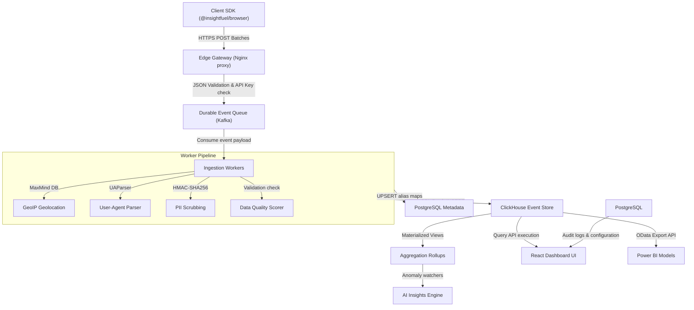

# InsightFuel — Database & Event Specification (DES)
**Version:** 2.0  
**Status:** Approved Reference  
**Audience:** Data Architects, SREs, Database Engineers, Backend Developers, and BI Analysts  

---

## 1. Database Philosophy

InsightFuel implements a polyglot persistence architecture. We split our data operations across three specialized stores (PostgreSQL, ClickHouse, and Redis) to isolate transactional state from analytical workloads, ensuring scalability under heavy write traffic.

```
                         [Client SDK / Dashboard Client]
                                        |
                 +----------------------+----------------------+
                 | Ingest Path                                 | Query & Admin Path
                 v                                             v
       +-------------------+                         +-------------------+
       | Ingestion Workers |                         | Query / Admin API |
       +---------+---------+                         +---------+---------+
                 |                                             |
         +-------+-------+                             +-------+-------+
         | Writes        | Writes                      | Reads         | Reads
         v               v                             v               v
  +------------+  +------------+                +------------+  +------------+
  | ClickHouse |  | PostgreSQL |                | PostgreSQL |  |   Redis    |
  | (OLAP Core)|  | (OLTP Core)|                | (Metadata) |  | (Caching)  |
  +------------+  +------------+                +------------+  +------------+
```

### 1.1 OLTP vs. OLAP Segmentation
*   **On-Line Transactional Processing (OLTP):** PostgreSQL handles our OLTP needs. Transactional data consists of highly relational records (users, project tokens, billing tier configurations, permission schemas) that change frequently via transactional CRUD operations. These operations require low-latency ACID safety, relational constraints, and multi-table joins.
*   **On-Line Analytical Processing (OLAP):** ClickHouse handles our OLAP needs. Product behavior telemetry generates millions of events per day. These events are write-once, read-many records that do not change. OLAP workloads perform large-scale column scans, filtering by project boundaries and time windows. ClickHouse scales horizontally using columnar layouts, sorting keys, and data compression.

### 1.2 Separation Rationale
1.  **PostgreSQL (Transactional Store):** Isolates administrative state from telemetry streams. An analytical scan of millions of events will never lock transactional configuration tables or impact dashboard logins.
2.  **ClickHouse (Columnar Event Store):** Organizes event properties into separate files. An aggregation query calculating unique active users on a project only reads two column files (`project_id` and `distinct_id`), ignoring all other metadata properties. This structure minimizes disk reads compared to relational row stores.
3.  **Redis (Memory Tier):** Exposes key-value stores. Operates as an in-memory cache to handle high-frequency actions, such as verifying API write keys at the edge, maintaining sessions, and serving cached query results to prevent duplicate database execution.

---

## 2. Complete PostgreSQL Schema (OLTP)

The PostgreSQL metadata database runs on a dedicated instance. It stores organization configurations, workspace setups, and access definitions.

### 2.1 Data Classification Model

Every field across the relational schema is classified according to its privacy, compliance, and access level. The table below defines these classifications and their associated policies:

| Classification | Storage Policy | Encryption Policy | Retention Policy | Access Policy |
|---|---|---|---|---|
| **Public** | Standard volumes | TLS in-transit | Indefinite / Active state | Unrestricted read access |
| **Internal** | Standard volumes | TLS in-transit, at-rest | Indefinite / Active state | Authenticated services and users |
| **Sensitive** | Encrypted volumes | TLS in-transit, at-rest | Active state, soft delete | Project Owners and Admins only |
| **Confidential** | Encrypted volumes | Column-level encryption | System lifecycle duration | System administration services only |
| **PII** | Masked / Anonymized | Column-level AES-256 | Configurable retention; purgeable | Cryptographic hash matching only |
| **Restricted** | Dedicated volumes | Strict at-rest and column keys | System lifecycle duration | Read-only by authorized billing webhooks |

---

### 2.2 Relational Tables Definition

#### 2.2.1 Table: organizations
*   **Purpose:** Parent tenant organizational profile.
*   **Expected Growth:** 1,000 rows/year (Low).
*   **Retention:** Active contract lifecycle duration.
*   **Audit Strategy:** Log status and plan changes to `audit_logs`.

```sql
CREATE TABLE organizations (
    id UUID PRIMARY KEY DEFAULT gen_random_uuid(), -- [Internal]
    name VARCHAR(255) NOT NULL, -- [Internal]
    plan_tier VARCHAR(50) NOT NULL DEFAULT 'free', -- [Sensitive]
    created_at TIMESTAMP WITH TIME ZONE NOT NULL DEFAULT NOW() -- [Internal]
);
```

#### 2.2.2 Table: projects
*   **Purpose:** Analytical workspace environments.
*   **Expected Growth:** 2,500 rows/year (Low).
*   **Retention:** Active status. Deleting a project triggers cascades across related tables.
*   **Audit Strategy:** Log metadata changes.

```sql
CREATE TABLE projects (
    id UUID PRIMARY KEY DEFAULT gen_random_uuid(), -- [Internal]
    org_id UUID NOT NULL REFERENCES organizations(id) ON DELETE CASCADE, -- [Internal]
    name VARCHAR(255) NOT NULL, -- [Internal]
    retention_days INTEGER NOT NULL DEFAULT 90, -- [Sensitive]
    pii_scrub_rules JSONB NOT NULL DEFAULT '[]'::jsonb, -- [Confidential]
    created_at TIMESTAMP WITH TIME ZONE NOT NULL DEFAULT NOW(), -- [Internal]
    CONSTRAINT chk_retention_days CHECK (retention_days >= 7 AND retention_days <= 1095)
);
CREATE INDEX idx_projects_org_id ON projects(org_id);
```

#### 2.2.3 Table: users
*   **Purpose:** User account profiles.
*   **Expected Growth:** 10,000 rows/year (Medium).
*   **Retention:** Account lifecycle.
*   **Audit Strategy:** Record authentication actions.

```sql
CREATE TABLE users (
    id UUID PRIMARY KEY DEFAULT gen_random_uuid(), -- [Internal]
    email VARCHAR(255) UNIQUE NOT NULL, -- [PII]
    password_hash VARCHAR(255) NOT NULL, -- [Restricted]
    first_name VARCHAR(100), -- [PII]
    last_name VARCHAR(100), -- [PII]
    created_at TIMESTAMP WITH TIME ZONE NOT NULL DEFAULT NOW() -- [Internal]
);
CREATE UNIQUE INDEX idx_users_email ON users(email);
```

#### 2.2.4 Table: roles
*   **Purpose:** RBAC definitions mapping users to projects.
*   **Expected Growth:** 20,000 rows/year (Medium).
*   **Retention:** Match organization lifecycle.

```sql
CREATE TABLE roles (
    id UUID PRIMARY KEY DEFAULT gen_random_uuid(), -- [Internal]
    project_id UUID NOT NULL REFERENCES projects(id) ON DELETE CASCADE, -- [Internal]
    user_id UUID NOT NULL REFERENCES users(id) ON DELETE CASCADE, -- [Internal]
    role_name VARCHAR(50) NOT NULL DEFAULT 'Viewer', -- [Sensitive]
    created_at TIMESTAMP WITH TIME ZONE NOT NULL DEFAULT NOW(), -- [Internal]
    CONSTRAINT unique_project_user_role UNIQUE(project_id, user_id),
    CONSTRAINT chk_role_name CHECK (role_name IN ('Owner', 'Admin', 'Analyst', 'Viewer'))
);
CREATE INDEX idx_roles_user ON roles(user_id);
```

#### 2.2.5 Table: api_keys
*   **Purpose:** Credentials used to authenticate Ingestion and Query requests.
*   **Expected Growth:** 5,000 rows/year (Low).
*   **Retention:** Key active duration.
*   **Audit Strategy:** Audit all creations, rotations, and revocations.

```sql
CREATE TABLE api_keys (
    id UUID PRIMARY KEY DEFAULT gen_random_uuid(), -- [Internal]
    project_id UUID NOT NULL REFERENCES projects(id) ON DELETE CASCADE, -- [Internal]
    key_hash VARCHAR(64) UNIQUE NOT NULL, -- [Confidential]
    key_type VARCHAR(20) NOT NULL, -- [Internal]
    name VARCHAR(100), -- [Internal]
    created_at TIMESTAMP WITH TIME ZONE NOT NULL DEFAULT NOW(), -- [Internal]
    expires_at TIMESTAMP WITH TIME ZONE, -- [Sensitive]
    is_revoked BOOLEAN NOT NULL DEFAULT FALSE, -- [Sensitive]
    CONSTRAINT chk_key_type CHECK (key_type IN ('write_only', 'read_only'))
);
CREATE INDEX idx_api_keys_hash ON api_keys(key_hash);
```

#### 2.2.6 Table: feature_registry
*   **Purpose:** Stores auto-discovered and manually mapped application features.
*   **Expected Growth:** 100,000 rows/year (High).
*   **Retention:** Active project lifecycle.
*   **Audit Strategy:** Record state updates and display name changes.

```sql
CREATE TABLE feature_registry (
    id UUID PRIMARY KEY DEFAULT gen_random_uuid(), -- [Internal]
    project_id UUID NOT NULL REFERENCES projects(id) ON DELETE CASCADE, -- [Internal]
    technical_name VARCHAR(255) NOT NULL, -- [Internal]
    display_name VARCHAR(255) NOT NULL, -- [Internal]
    description TEXT, -- [Internal]
    category VARCHAR(100) NOT NULL DEFAULT 'default', -- [Internal]
    parent_feature_id UUID REFERENCES feature_registry(id) ON DELETE SET NULL, -- [Internal]
    tags VARCHAR(50)[] DEFAULT '{}'::VARCHAR(50)[], -- [Internal]
    owner_email VARCHAR(255), -- [PII]
    status VARCHAR(50) NOT NULL DEFAULT 'Discovered', -- [Sensitive]
    created_date TIMESTAMP WITH TIME ZONE NOT NULL DEFAULT NOW(), -- [Internal]
    first_seen TIMESTAMP WITH TIME ZONE NOT NULL DEFAULT NOW(), -- [Internal]
    last_seen TIMESTAMP WITH TIME ZONE NOT NULL DEFAULT NOW(), -- [Internal]
    usage_count BIGINT NOT NULL DEFAULT 0, -- [Internal]
    current_trend DOUBLE PRECISION NOT NULL DEFAULT 0.0, -- [Internal]
    health_score DOUBLE PRECISION NOT NULL DEFAULT 100.0, -- [Internal]
    popularity_rank INTEGER, -- [Internal]
    engagement_score DOUBLE PRECISION NOT NULL DEFAULT 0.0, -- [Internal]
    retirement_date TIMESTAMP WITH TIME ZONE, -- [Sensitive]
    CONSTRAINT unique_project_tech_name UNIQUE(project_id, technical_name),
    CONSTRAINT chk_status CHECK (status IN ('Discovered', 'Candidate', 'Pending Approval', 'Tracked', 'Deprecated', 'Retired', 'Archived'))
);
CREATE INDEX idx_feature_registry_lookup ON feature_registry(project_id, status);
```

#### 2.2.7 Table: feature_groups
*   **Purpose:** Logical collections of features representing functional areas.
*   **Expected Growth:** 10,000 rows/year (Low).

```sql
CREATE TABLE feature_groups (
    id UUID PRIMARY KEY DEFAULT gen_random_uuid(), -- [Internal]
    project_id UUID NOT NULL REFERENCES projects(id) ON DELETE CASCADE, -- [Internal]
    name VARCHAR(100) NOT NULL, -- [Internal]
    description TEXT, -- [Internal]
    created_at TIMESTAMP WITH TIME ZONE NOT NULL DEFAULT NOW() -- [Internal]
);
```

#### 2.2.8 Table: feature_group_mappings
*   **Purpose:** Many-to-many relationship mapping features to feature groups.
```sql
CREATE TABLE feature_group_mappings (
    group_id UUID NOT NULL REFERENCES feature_groups(id) ON DELETE CASCADE, -- [Internal]
    feature_id UUID NOT NULL REFERENCES feature_registry(id) ON DELETE CASCADE, -- [Internal]
    PRIMARY KEY (group_id, feature_id)
);
```

#### 2.2.9 Table: product_health_snapshots
*   **Purpose:** Trailing log of project health metrics.
*   **Expected Growth:** 8.7 million rows/year (Medium). Recalculated hourly for each active project.
*   **Retention:** 365 Days. Older data is aggregated into monthly trends.

```sql
CREATE TABLE product_health_snapshots (
    id UUID PRIMARY KEY DEFAULT gen_random_uuid(), -- [Internal]
    project_id UUID NOT NULL REFERENCES projects(id) ON DELETE CASCADE, -- [Internal]
    computed_at TIMESTAMP WITH TIME ZONE NOT NULL, -- [Internal]
    composite_score DOUBLE PRECISION NOT NULL, -- [Internal]
    sub_scores JSONB NOT NULL, -- [Internal]
    created_at TIMESTAMP WITH TIME ZONE NOT NULL DEFAULT NOW() -- [Internal]
);
CREATE INDEX idx_health_snapshots_query ON product_health_snapshots(project_id, computed_at DESC);
```

#### 2.2.10 Table: ai_insights
*   **Purpose:** Automatically generated performance recommendations.
*   **Expected Growth:** 100,000 rows/year (Low).
*   **Retention:** 90 Days.
*   **Audit Strategy:** Record review actions (Dismissed, Acknowledged).

```sql
CREATE TABLE ai_insights (
    id UUID PRIMARY KEY DEFAULT gen_random_uuid(), -- [Internal]
    project_id UUID NOT NULL REFERENCES projects(id) ON DELETE CASCADE, -- [Internal]
    category VARCHAR(100) NOT NULL, -- [Internal]
    generated_text TEXT NOT NULL, -- [Internal]
    supporting_metric_ref JSONB NOT NULL, -- [Internal]
    severity VARCHAR(20) NOT NULL DEFAULT 'info', -- [Sensitive]
    status VARCHAR(20) NOT NULL DEFAULT 'active', -- [Sensitive]
    ai_model_version VARCHAR(50) NOT NULL, -- [Internal]
    recommendation_version VARCHAR(50) NOT NULL, -- [Internal]
    generated_at TIMESTAMP WITH TIME ZONE NOT NULL DEFAULT NOW(), -- [Internal]
    CONSTRAINT chk_severity CHECK (severity IN ('critical', 'warning', 'info')),
    CONSTRAINT chk_status CHECK (status IN ('active', 'dismissed', 'acknowledged'))
);
CREATE INDEX idx_ai_insights_query ON ai_insights(project_id, status, generated_at DESC);
```

#### 2.2.11 Table: dashboard_configurations
*   **Purpose:** Dashboard widget locations, sizes, and layout configurations.
*   **Expected Growth:** 5,000 rows/year (Low).
*   **Retention:** Indefinite.

```sql
CREATE TABLE dashboard_configurations (
    id UUID PRIMARY KEY DEFAULT gen_random_uuid(), -- [Internal]
    project_id UUID NOT NULL REFERENCES projects(id) ON DELETE CASCADE, -- [Internal]
    user_id UUID NOT NULL REFERENCES users(id) ON DELETE CASCADE, -- [Internal]
    name VARCHAR(150) NOT NULL, -- [Internal]
    layout_grid JSONB NOT NULL, -- [Internal]
    created_at TIMESTAMP WITH TIME ZONE NOT NULL DEFAULT NOW() -- [Internal]
);
```

#### 2.2.12 Table: audit_logs
*   **Purpose:** Immutable trail recording administration updates.
*   **Expected Growth:** 1 million rows/year (Medium).
*   **Retention:** 7 Years (Compliance requirement).
*   **Audit Strategy:** Insert-only. Deletes or updates on this table are blocked by DB triggers.

```sql
CREATE TABLE audit_logs (
    id UUID PRIMARY KEY DEFAULT gen_random_uuid(), -- [Internal]
    org_id UUID NOT NULL REFERENCES organizations(id) ON DELETE CASCADE, -- [Internal]
    actor_id UUID NOT NULL REFERENCES users(id) ON DELETE RESTRICT, -- [Internal]
    action_type VARCHAR(100) NOT NULL, -- [Internal]
    target_entity VARCHAR(100) NOT NULL, -- [Internal]
    target_id UUID, -- [Internal]
    changes JSONB NOT NULL, -- [Sensitive]
    ip_address INET, -- [PII]
    created_at TIMESTAMP WITH TIME ZONE NOT NULL DEFAULT NOW() -- [Internal]
);
CREATE INDEX idx_audit_logs_query ON audit_logs(org_id, created_at DESC);
```

#### 2.2.13 Table: sdk_configurations
*   **Purpose:** Project-specific initialization values fetched by SDKs.
*   **Expected Growth:** 5,000 rows/year (Low).

```sql
CREATE TABLE sdk_configurations (
    id UUID PRIMARY KEY DEFAULT gen_random_uuid(), -- [Internal]
    project_id UUID UNIQUE NOT NULL REFERENCES projects(id) ON DELETE CASCADE, -- [Internal]
    autocapture_enabled BOOLEAN NOT NULL DEFAULT TRUE, -- [Internal]
    respect_dnt BOOLEAN NOT NULL DEFAULT TRUE, -- [Internal]
    sampling_rate DOUBLE PRECISION NOT NULL DEFAULT 1.0, -- [Internal]
    blacklist_selectors VARCHAR(255)[] DEFAULT '{}'::VARCHAR(255)[], -- [Internal]
    updated_at TIMESTAMP WITH TIME ZONE NOT NULL DEFAULT NOW() -- [Internal]
);
```

#### 2.2.14 Table: webhooks
*   **Purpose:** Target webhook URLs for system integrations and alerting.
*   **Expected Growth:** 1,000 rows/year (Low).

```sql
CREATE TABLE webhooks (
    id UUID PRIMARY KEY DEFAULT gen_random_uuid(), -- [Internal]
    project_id UUID NOT NULL REFERENCES projects(id) ON DELETE CASCADE, -- [Internal]
    target_url TEXT NOT NULL, -- [Confidential]
    secret_token VARCHAR(255) NOT NULL, -- [Restricted]
    events_subscribed VARCHAR(100)[] NOT NULL, -- [Internal]
    is_active BOOLEAN NOT NULL DEFAULT TRUE, -- [Sensitive]
    created_at TIMESTAMP WITH TIME ZONE NOT NULL DEFAULT NOW() -- [Internal]
);
```

#### 2.2.15 Table: integrations
*   **Purpose:** Setup parameters for third-party tools (Slack, Teams, Data Warehouses).
*   **Expected Growth:** 1,000 rows/year (Low).

```sql
CREATE TABLE integrations (
    id UUID PRIMARY KEY DEFAULT gen_random_uuid(), -- [Internal]
    project_id UUID NOT NULL REFERENCES projects(id) ON DELETE CASCADE, -- [Internal]
    platform VARCHAR(50) NOT NULL, -- [Internal]
    credentials JSONB NOT NULL, -- [Restricted]
    is_active BOOLEAN NOT NULL DEFAULT TRUE, -- [Sensitive]
    created_at TIMESTAMP WITH TIME ZONE NOT NULL DEFAULT NOW() -- [Internal]
);
```

---

## 3. Complete ClickHouse Design (OLAP)

ClickHouse stores our high-volume analytics event streams. It uses columnar layouts and index keys to process millions of rows in milliseconds.

```
                    +------------------------------------+
                    |       events (Distributed)         |
                    +-----------------+------------------+
                                      |
                                      | Writes (Hash by project_id)
                                      v
                    +------------------------------------+
                    |       events_local (Shard)         |
                    |      - ReplacingMergeTree          |
                    +-----------------+------------------+
                                      |
                                      | Materialized Views
                                      v
                    +------------------------------------+
                    | daily_rollups / feature_metrics_mv |
                    +------------------------------------+
```

### 3.1 Raw Events Table (`events_local`)
The primary destination for ingestion workers. It uses the `ReplacingMergeTree` engine. This engine removes duplicate records on the read side during merge operations, utilizing `event_id` and the latest `ingested_at` timestamp.

#### 3.1.1 ClickHouse DDL & Column Mappings
```sql
CREATE TABLE events_local ON CLUSTER insightfuel_cluster (
    -- Primary Keys & Identifiers
    project_id UUID,
    event_id String,
    event_name LowCardinality(String),
    category LowCardinality(String),
    distinct_id String,
    session_id String,
    
    -- Timestamps
    timestamp DateTime64(3, 'UTC') CODEC(DoubleDelta, LZ4),
    ingested_at DateTime CODEC(DoubleDelta, LZ4),
    
    -- Validation, Schema Versioning & Data Quality
    schema_version LowCardinality(String) DEFAULT '1.0.0',
    sdk_version LowCardinality(String) DEFAULT '1.0.0',
    event_version LowCardinality(String) DEFAULT '1.0.0',
    quality_score Float32 CODEC(T64, LZ4),
    
    -- Telemetry Metadata
    context_url String CODEC(ZSTD(1)),
    context_referrer String CODEC(ZSTD(1)),
    context_browser LowCardinality(String),
    context_os LowCardinality(String),
    context_device LowCardinality(String),
    context_timezone LowCardinality(String),
    context_viewport_width UInt16,
    context_viewport_height UInt16,
    context_screen_width UInt16,
    context_screen_height UInt16,
    context_connection_type LowCardinality(String),
    context_language LowCardinality(String),
    context_platform LowCardinality(String),
    
    -- Core Web Vitals
    perf_fid_ms Float32 CODEC(T64, LZ4),
    perf_lcp_ms Float32 CODEC(T64, LZ4),
    perf_cls Float32 CODEC(T64, LZ4),
    
    -- UTM Campaign Tracking
    utm_source LowCardinality(String),
    utm_medium LowCardinality(String),
    utm_campaign LowCardinality(String),
    utm_term LowCardinality(String),
    utm_content LowCardinality(String),
    
    -- Dynamic Properties Map
    properties Map(String, String) CODEC(ZSTD(1)),
    properties_num Map(String, Float64) CODEC(ZSTD(3)),
    
    -- Future Ready Extensions (Reserved Fields)
    reserved_mobile_metadata Map(String, String) CODEC(ZSTD(1)),
    reserved_desktop_metadata Map(String, String) CODEC(ZSTD(1)),
    reserved_plugin_metadata Map(String, String) CODEC(ZSTD(1)),
    reserved_ab_experiment_ids Array(String) CODEC(ZSTD(1)),
    reserved_ai_recommendation_ref Array(String) CODEC(ZSTD(1)),
    reserved_offline_replay_metadata Map(String, String) CODEC(ZSTD(1))
)
ENGINE = ReplacingMergeTree(ingested_at)
PARTITION BY toYYYYMM(timestamp)
PRIMARY KEY (project_id, timestamp)
ORDER BY (project_id, timestamp, event_name, distinct_id, event_id)
SETTINGS index_granularity = 8192;
```

#### 3.1.2 Sharding & Distributed Wrapper
To scale across multiple ClickHouse instances, a `Distributed` table is exposed to query services. Pushes to this table route events to local shards using `project_id` hash partitions:
```sql
CREATE TABLE events ON CLUSTER insightfuel_cluster
AS events_local
ENGINE = Distributed(insightfuel_cluster, currentDatabase(), events_local, rand());
```

---

### 3.2 Materialized Views & Rollups

To ensure dashboard response times remain under 250 milliseconds without recalculating billions of raw event records on every view, ClickHouse uses materialized views. These views process incoming batches in memory and update daily rollup tables.

```
                    +------------------------------------+
                    |        events_local Table          |
                    +-----------------+------------------+
                                      |
                            Batch     | Materialized
                            Writes    | Views (In-Memory)
                                      v
         +----------------------------+----------------------------+
         |                            |                            |
         v                            v                            v
+--------+--------+          +--------+--------+          +--------+--------+
| daily_rollups   |          | daily_features  |          | daily_sessions  |
| (Active Users)  |          | (Adoption/Stick)|          | (Quality/Dur)   |
+-----------------+          +-----------------+          +-----------------+
```

#### 3.2.1 Daily Workspace Rollups (`daily_rollups`)
*   **Purpose:** Pre-aggregates daily active counts (DAU, WAU, MAU) and event counts per project.
*   **DDL Definition:**
```sql
CREATE TABLE daily_rollups (
    project_id UUID,
    day Date,
    event_name LowCardinality(String),
    total_events UInt64,
    unique_users AggregateFunction(uniq, String)
)
ENGINE = SummingMergeTree()
PARTITION BY toYYYYMM(day)
PRIMARY KEY (project_id, day)
ORDER BY (project_id, day, event_name);
```

##### Rollup Materialized View DDL
```sql
CREATE MATERIALIZED VIEW daily_rollups_mv TO daily_rollups AS
SELECT
    project_id,
    toDate(timestamp) AS day,
    event_name,
    count() AS total_events,
    uniqState(distinct_id) AS unique_users
FROM events_local
GROUP BY project_id, day, event_name;
```

#### 3.2.2 Daily Feature Usage Metrics (`daily_features`)
*   **Purpose:** Tracks interaction frequencies and stickiness indexes for discovered features.
```sql
CREATE TABLE daily_features (
    project_id UUID,
    day Date,
    feature_key String,
    usage_count UInt64,
    unique_feature_users AggregateFunction(uniq, String)
)
ENGINE = SummingMergeTree()
PARTITION BY toYYYYMM(day)
PRIMARY KEY (project_id, day)
ORDER BY (project_id, day, feature_key);
```

##### Feature Rollup Materialized View DDL
```sql
CREATE MATERIALIZED VIEW daily_features_mv TO daily_features AS
SELECT
    project_id,
    toDate(timestamp) AS day,
    substring(event_name, 14) AS feature_key, -- Extracts from feature_used:<key>
    count() AS usage_count,
    uniqState(distinct_id) AS unique_feature_users
FROM events_local
WHERE event_name LIKE 'feature_used:%'
GROUP BY project_id, day, feature_key;
```

#### 3.2.3 Daily Session Quality & Performance (`daily_sessions`)
*   **Purpose:** Pre-calculates average session durations and bounce statistics.
```sql
CREATE TABLE daily_sessions (
    project_id UUID,
    day Date,
    avg_duration_s Float64,
    bounce_sessions UInt64,
    total_sessions UInt64
)
ENGINE = MergeTree()
PARTITION BY toYYYYMM(day)
PRIMARY KEY (project_id, day)
ORDER BY (project_id, day);
```

---

## 4. Redis Specification

Redis acts as our in-memory storage tier, verifying credentials at the edge and managing cache expiration limits.

```
+---------------------------------------------------------------------------------------+
|                                    REDIS MEMORY MAP                                   |
+--------------------+--------------------+--------------------+------------------------+
| Rate Limit Windows | API Auth Keys      | Feature Registry   | Dashboard Queries      |
| - Key: rl:proj_id  | - Key: auth:key    | - Key: feat:lookup | - Key: q:hash          |
| - Value: count     | - Value: proj_id   | - Value: status    | - Value: JSON          |
| - TTL: 60s         | - TTL: 24 Hours    | - TTL: 1 Hour      | - TTL: 300s            |
+--------------------+--------------------+--------------------+------------------------+
```

### 4.1 Redis Key Layout Schema

| Cache Category | Key Format / Pattern | Value Structure | Default TTL | Invalidation Strategy |
|---|---|---|---|---|
| **Rate Limit** | `rl:<project_id>:<window_timestamp>` | `Int` (Request Counter) | 60 Seconds | Auto-expires on timer |
| **API Auth Key** | `auth:api_key:<hashed_key>` | `String` (UUID project_id) | 24 Hours | Event-driven on key revoke |
| **Session State**| `session:active:<session_id>` | `Hash` (User profile metadata) | 30 Minutes | sliding window update |
| **Feature Registry**| `feat:lookup:<project_id>:<tech_name>` | `Hash` (ID, Display Name, Status) | 1 Hour | Event-driven on registry edit |
| **Query Results**| `query:cache:<project_id>:<query_hash>` | `String` (JSON Query Results) | 300 Seconds | Auto-expires on timer |

### 4.2 Caching Strategy & Validation Flows

1.  **Rate Limiting sliding-window algorithm:**  
    For an incoming request, the Ingestion Gateway increments the sliding window token bucket:
    ```
    MULTI
    INCRBY rl:proj_123:1783955600 1
    EXPIRE rl:proj_123:1783955600 60
    EXEC
    ```
    If the increment result exceeds the project's plan limit per minute, the Gateway returns HTTP 429.
2.  **API Authorization Cache:**  
    API write keys are verified at the Gateway using cached lookups.
    *   **Cache Hit:** Gateway routes the request immediately (< 1.5ms).
    *   **Cache Miss:** Resolves key hashes against PostgreSQL, caches the result in Redis with a 24-hour TTL, and routes the request.
3.  **Active Session Sliding Window:**  
    SDK requests update the session key expiration time. A session is active as long as the user makes requests within a 30-minute window:
    ```
    EXPIRE session:active:sess_883011 1800
    ```
4.  **Query Result Cache Invalidation:**  
    Analytical query payloads are cached using a SHA-256 hash of the request parameters.
    *   **Invalidation:** Event-driven invalidation is not used. Dashboards fetch data with an auto-refresh timer, so queries naturally expire via the 300-second TTL. This avoids database lock queues from frequent, small cache updates.

---

## 5. Event Taxonomy

InsightFuel categorizes all received events into exactly one of nine categories to ensure uniform processing downstream.

```
                                  [Incoming Event]
                                         |
         +-------------------------------+-------------------------------+
         | (Routing by Event Schema Properties)                           |
         v                                                               v
+--------+--------+   +--------+--------+   +--------+--------+   +--------+--------+
|   Navigation    |   |    Feature     |   |    Session     |   |  Performance   |
| - route_change  |   | - feature_used |   | - sess_started |   | - web_vitals   |
+-----------------+   +-----------------+   +-----------------+   +-----------------+
         |                    |                     |                     |
         v                    v                     v                     v
+--------+--------+   +--------+--------+   +--------+--------+   +--------+--------+
|     Error       |   |    Business    |   |    System      |   |      User       |
| - js_exception  |   | - purchase_cmp |   | - sdk_flush    |   | - id_resolved   |
+-----------------+   +-----------------+   +-----------------+   +-----------------+
                                         |
                                         v
                                +--------+--------+
                                |     Custom      |
                                | - app_defined  |
                                +-----------------+
```

### 5.1 Category Specifications

#### 5.1.1 Navigation Events
*   **Purpose:** Tracks user movement through the host application.
*   **Required Fields:** `from_path` (String), `to_path` (String), `transition_type` (String).
*   **Optional Fields:** `route_params` (Map).
*   **Validation:** Path parameters must begin with a forward slash `/` or act as a valid URL.
*   **Naming Convention:** Always uses lowercase snake_case representing the structural change (e.g., `route_change`, `tab_switch`).

#### 5.1.2 Feature Events
*   **Purpose:** Logs distinct features touched within the application.
*   **Required Fields:** `selector` (String), `page_context` (String), `interaction_type` (String).
*   **Optional Fields:** `feature_label` (String).
*   **Validation:** `interaction_type` must match one of: `click`, `submit`, `change`, `focus`.
*   **Naming Convention:** Prefixed with `feature_used:` followed by the unique feature key (e.g., `feature_used:export_billing`).

#### 5.1.3 Session Events
*   **Purpose:** Identifies session startup, boundaries, and timeouts.
*   **Required Fields:** `session_duration_s` (Float), `entry_url` (String).
*   **Optional Fields:** `exit_url` (String).
*   **Naming Convention:** Past-tense verbs (e.g., `session_started`, `session_ended`).

#### 5.1.4 Performance Events
*   **Purpose:** Tracks client-side speed performance.
*   **Required Fields:** `dom_interactive_ms` (Float), `page_load_time_ms` (Float).
*   **Optional Fields:** `largest_contentful_paint_ms` (Float), `first_input_delay_ms` (Float), `cumulative_layout_shift` (Float).
*   **Naming Convention:** Ending in `_performance` (e.g., `page_performance`).

#### 5.1.5 Error Events
*   **Purpose:** Captures runtime code exceptions and request failures.
*   **Required Fields:** `error_message` (String), `file_source` (String).
*   **Optional Fields:** `error_stack` (String), `line_number` (Int).
*   **Naming Convention:** Identifies the error source (e.g., `js_exception`, `api_error`).

#### 5.1.6 Business Events
*   **Purpose:** Logs conversion benchmarks (e.g., plan upgrades, document sharing).
*   **Required Fields:** `transaction_id` (String), `amount` (Float), `currency` (String).
*   **Naming Convention:** Formatted as `<action>_completed` (e.g., `checkout_completed`).

#### 5.1.7 System Events
*   **Purpose:** Logs SDK health diagnostics (e.g., flush updates, local memory spool cleanups).
*   **Required Fields:** `batch_size` (Int), `flush_trigger` (String).
*   **Naming Convention:** SDK utility names (e.g., `sdk_flush_triggered`).

#### 5.1.8 User Events
*   **Purpose:** Tracks identity changes and user login states.
*   **Required Fields:** `anonymous_id` (String).
*   **Optional Fields:** `traits` (Map).
*   **Naming Convention:** Tracks profile changes (e.g., `user_identified`, `user_logged_out`).

#### 5.1.9 Custom Events
*   **Purpose:** Allows teams to track custom application-specific actions.
*   **Required Fields:** `custom_payload` (Map).

---

## 6. Event Naming Standards

To prevent database pollution and maintain query performance, teams must follow strict event naming conventions.

### 6.1 Lexical & Formatting Guidelines
1.  **Strict Casing:** All event names must use lowercase `snake_case`. Capital letters, spaces, and hyphens are not allowed.
2.  **Verb-Noun / Noun-Verb Structure:** Names must represent a completed action using a past-tense verb:
    *   *Correct:* `checkout_completed`, `document_shared`, `invite_sent`.
    *   *Incorrect:* `completeCheckout`, `ShareDocument`, `send_invite`.
3.  **Maximum Length:** Event names are capped at 128 characters. Properties keys are capped at 64 characters.

### 6.2 Prohibited Event Names & Keywords
The Ingestion API checks event names against a list of prohibited keywords. Event names containing these keywords are rejected:

| Prohibited Pattern | Reason | Alternative Pattern |
|---|---|---|
| `select`, `insert`, `update`, `delete` | SQL command keywords; rejected to prevent injection | Use action terms: `filter_selected`, `row_added` |
| `click`, `hover`, `focus`, `submit` | Generic DOM actions are too broad | Use target descriptions: `billing_button_clicked` |
| `page`, `url`, `path` | Broad system navigation values | Use taxonomy standards: `route_change` |
| `user`, `profile` | Conflicts with user profile updates | Use identity names: `user_identified` |
| `*` (Wildcards), `?`, `/` | Special character limits | Remove symbols |

---

## 7. Event Data Contracts & Versioning

Every event pushed to the Ingestion API must comply with the base JSON schema.

### 7.1 Base JSON Schema
```json
{
  "$schema": "http://json-schema.org/draft-07/schema#",
  "title": "InsightFuelBaseEvent",
  "type": "OBJECT",
  "properties": {
    "event_id": { "type": "STRING", "pattern": "^evt_[a-f0-9]{16}$" },
    "event_name": { "type": "STRING", "maxLength": 128 },
    "category": { "type": "STRING", "enum": ["navigation", "feature", "session", "performance", "error", "business", "system", "user", "custom"] },
    "distinct_id": { "type": "STRING", "maxLength": 255 },
    "project_id": { "type": "STRING", "pattern": "^[0-9a-f]{8}-[0-9a-f]{4}-4[0-9a-f]{3}-[89ab][0-9a-f]{3}-[0-9a-f]{12}$" },
    "timestamp": { "type": "STRING", "format": "date-time" },
    "schema_version": { "type": "STRING", "pattern": "^[0-9]+\\.[0-9]+\\.[0-9]+$" },
    "sdk_version": { "type": "STRING", "pattern": "^[0-9]+\\.[0-9]+\\.[0-9]+$" },
    "event_version": { "type": "STRING", "pattern": "^[0-9]+\\.[0-9]+\\.[0-9]+$" },
    "properties": { "type": "OBJECT", "maxProperties": 50 },
    "properties_num": { "type": "OBJECT", "maxProperties": 50 }
  },
  "required": ["event_id", "event_name", "category", "distinct_id", "project_id", "timestamp", "schema_version"]
}
```

### 7.2 Event Versioning Strategy

To manage modifications to event structures without breaking dashboard queries or storage pipelines, the system uses semantic version tracking.

```
[Event Version: X.Y.Z]
  |
  +---> X (Major): Breaking changes. (Requires a new topic / DB schema migration).
  +---> Y (Minor): Non-breaking additions. (Properties added, handled by schemas).
  +---> Z (Patch): Internal updates. (Documentation changes, comment updates).
```

*   **Backward Compatibility:** Workers must always be able to parse historical event structures. If a property is removed in version `2.0.0`, the Query Service fills missing fields in historical `1.x` queries with `NULL`.
*   **Forward Compatibility:** Older SDK nodes may transmit events before workers are updated to newer schemas. The validation pipeline routes unrecognized properties into a flexible `properties` map column in ClickHouse, rather than rejecting the payload.
*   **Event Deprecation Policy:** When an event type is marked for deprecation:
    1.  The project settings log the event status as deprecated.
    2.  The developer dashboard displays a warning indicating the event is scheduled for retirement.
    3.  A 90-day grace period begins, after which ingestion workers discard the event.
*   **Event Migration Strategy:** If an event structure requires breaking changes:
    *   The event version increments (e.g., `event_version` from `1.1.0` to `2.0.0`).
    *   Ingestion workers parse both schemas. They normalize version `1.1` fields and map them to the corresponding version `2.0` columns in ClickHouse. This approach handles schema updates without requiring changes to raw database tables.

---

## 8. SDK Metadata Specification & Time Dimension

To ensure consistent filtering, the SDK collects system environment properties automatically. In addition, the system provides a Date Dimension schema to support Power BI integrations.

### 8.1 Automated Metadata Fields

| Field Key | Source API | Description | Example Value |
|---|---|---|---|
| `context_browser` | User-Agent string | Browser engine name | `Chrome` |
| `context_os` | User-Agent string | OS system name | `Windows` |
| `context_device` | User-Agent string | Detected hardware category | `desktop` |
| `context_timezone` | `Intl.DateTimeFormat` | Client offset name | `America/New_York` |
| `context_viewport_width` | `window.innerWidth` | Visible viewport width (pixels) | `1440` |
| `context_viewport_height` | `window.innerHeight` | Visible viewport height (pixels) | `900` |
| `context_screen_width` | `window.screen.width` | Physical screen width | `1920` |
| `context_screen_height` | `window.screen.height` | Physical screen height | `1080` |
| `context_connection_type` | `navigator.connection` | Network speed classification | `4g` |
| `context_language` | `navigator.language` | Active system locale | `en-US` |
| `context_platform` | Navigator platform | Runtime engine environment | `Win32` |
| `perf_fid_ms` | PerformanceObserver | First Input Delay duration | `16.2` |
| `perf_lcp_ms` | PerformanceObserver | Largest Contentful Paint duration | `820.0` |
| `perf_cls` | PerformanceObserver | Cumulative Layout Shift metric | `0.02` |
| `utm_source` | URLSearchParams | Campaign source identifier | `newsletter` |
| `utm_medium` | URLSearchParams | Campaign channel identifier | `email` |
| `utm_campaign` | URLSearchParams | Campaign campaign name | `summer_promo` |

---

### 8.2 Power BI Date Dimension Specification (`DimDates`)

The `DimDates` table supports date intelligence calculations (such as Month-over-Month growth and calendar comparisons). Using a dedicated Date table prevents performance bottlenecks from dynamically parsing timestamp fields during queries.

```
+----------------------------------------------------------------------------------------+
|                                    DIMDATES TABLE                                      |
+----------------------------------------------------------------------------------------+
| PK  DateKey          INT (Format: YYYYMMDD)                                            |
|     CalendarDate     DATE                                                              |
|     Year             INT                                                               |
|     Quarter          INT                                                               |
|     Month            INT                                                               |
|     MonthName        VARCHAR(20)                                                       |
|     Week             INT                                                               |
|     ISOWeek          INT                                                               |
|     DayName          VARCHAR(20)                                                       |
|     HourBucket       INT (0 - 23)                                                      |
|     WeekendFlag      BOOLEAN                                                           |
|     HolidayFlag      BOOLEAN                                                           |
|     FiscalYear       INT                                                               |
|     FiscalQuarter    INT                                                               |
|     Timezone         VARCHAR(100) DEFAULT 'UTC'                                        |
|     UTCOffset        INTERVAL                                                          |
+----------------------------------------------------------------------------------------+
```
Using the pre-calculated fields in `DimDates` (such as `WeekendFlag` and `HolidayFlag`) allows analysts to filter out patterns caused by weekends or holidays without writing complex SQL queries.

---

## 9. Feature Registry Design & Lifecycle

The Feature Registry manages user interaction surfaces. It registers candidate elements discovered in telemetry streams, maps them to the product hierarchy, and provides status controls to manage historical data.

### 9.1 Feature State Transitions

```
 [Discovered] (DOM click captured by worker)
      |
      | Threshold Met: 50 events / 5 unique users / 14 days
      v
 [Candidate]
      |
      | Owner approves feature
      v
 [Pending Approval]
      |
      | Admin/Owner maps display details
      v
  [Tracked] (Active health analytics tracking)
      |
      | Deprecation flag activated
      v
 [Deprecated] (Throws warning, hidden from AI metrics)
      |
      | Retirement date hit
      v
  [Retired] (Ingest drops new actions, keeps history)
      |
      | Inactive for 180 Days
      v
  [Archived] (Logs only, excluded from dashboards)
```

#### 9.1.1 State Transition Matrix (ASCII Diagram)
```
+--------------+   Threshold   +-------------+   Approve   +------------------+
|  Discovered  | ------------> |  Candidate  | ----------> | Pending Approval |
+--------------+               +-------------+             +--------+---------+
                                                                    | Map Info
                                                                    v
+--------------+   180d Idle   +-------------+   Retire    +------------------+
|   Archived   | <------------ |   Retired   | <---------- |     Tracked      |
+--------------+               +-------------+             +--------+---------+
                                                                    | Deprecate
                                                                    v
                                                           +------------------+
                                                           |    Deprecated    |
                                                           +------------------+
```

### 9.2 Lifecycle Phase Definitions
1.  **Discovered:** The event is logged in PostgreSQL by workers processing newly discovered DOM selectors. The feature is not yet visible in dashboards.
2.  **Candidate:** The selector crosses the volume threshold (50 interactions across at least 5 distinct users within a 14-day window). It is promoted to candidate status and appears in the Feature Registry UI for review.
3.  **Pending Approval:** A product manager flags the candidate for inclusion in tracking plans. The feature is locked in the registry while configuration parameters are defined.
4.  **Tracked:** The feature is actively tracked. Display names are resolved, and the feature is included in the calculations for the Product Health Score and Feature Engagement rankings.
5.  **Deprecated:** The feature is scheduled for removal. Warnings are shown in user dashboards, and the feature is excluded from new AI recommendation evaluations.
6.  **Retired:** Ingestion workers discard new incoming events matching this selector. Existing historical events are preserved in database logs.
7.  **Archived:** The feature is hidden from dashboards. Historical logs are archived to cold storage, and the feature configuration in PostgreSQL is marked read-only.

---

## 10. Feature Discovery & Parsing Algorithm

The Feature Discovery Engine processes client-side telemetry to identify stable feature selectors while filtering out dynamic noise and volatile elements.

### 10.1 Selector Normalization & Cleaning

```
Raw Click Selector ------------------------------------> [Clean Selector]
(e.g., div#app > form_abc8812 > input[name="token"])        |
                                                            v
                                                  [Similarity Score Engine]
                                                  - Levenshtein Distance
                                                  - Cosine Structural Similarity
                                                            |
                                                            +---> Matches Tracked? --> Map event
                                                            |
                                                            +---> New Feature? ------> Log candidate
```

1.  **Tokenization & Hash Removal:**  
    Removes auto-generated hashes (such as random IDs generated by React, Angular, or CSS-in-JS libraries) from selector strings using regular expressions:
    ```
    pattern: \b[0-9a-fA-F]{8,16}\b (Strips alphanumeric hash groups)
    pattern: \b\d{4,}\b (Strips long numerical indexes)
    ```
    *   *Input:* `button.btn-primary.btn_77182ab9.active`
    *   *Output:* `button.btn-primary.active`
2.  **Parent Node Pruning:**  
    Truncates long DOM selector paths to the nearest stable parent element containing a `data-testid` or unique `id` attribute. This prevents path variations caused by minor layout updates:
    *   *Input:* `html > body > div#app-container > div.row > div.col-md-6 > button#submit-btn`
    *   *Output:* `button#submit-btn`

### 10.2 Structural Similarity Calculations

To group minor variations of the same UI element (such as buttons generated inside list templates with dynamic item IDs), the system calculates structural similarity scores.

#### 10.2.1 Levenshtein Distance Threshold
Calculates the minimum character edit distance between normalized selector strings.

$$\text{Levenshtein}(A, B) \le 4$$

#### 10.2.2 Cosine Similarity on Tag Structure Tokens
Converts element paths into term-frequency vectors based on HTML tag names.

$$\text{Similarity}(A, B) = \frac{\vec{A} \cdot \vec{B}}{\|\vec{A}\| \|\vec{B}\|}$$

Where:
*   $\vec{A}$ and $\vec{B}$ represent the tokenized tag vectors (e.g., `[div, form, input]` vs `[div, form, select]`).
*   A calculated similarity score $\ge 0.85$ groups the selectors as the same functional feature candidate.

### 10.3 False-Positive Prevention
The system ignores events triggered on non-interactive elements (such as `div` wrappers, `span` blocks, or table rows) unless they contain explicit click event listeners or carry specific CSS pointer rules. This avoids database pollution from random page clicks.

---

## 11. Identity Resolution

The Identity Resolution engine links anonymous client-side actions to verified user accounts across multiple sessions and devices.

### 11.1 Identity Mapping Schema (`UserAliases`)
PostgreSQL stores distinct mapping keys in the `user_aliases` table to resolve user identities:

```sql
CREATE TABLE user_aliases (
    id UUID PRIMARY KEY DEFAULT gen_random_uuid(),
    project_id UUID NOT NULL REFERENCES projects(id) ON DELETE CASCADE,
    anonymous_id VARCHAR(255) NOT NULL,
    identified_id VARCHAR(255) NOT NULL,
    created_at TIMESTAMP WITH TIME ZONE NOT NULL DEFAULT NOW(),
    CONSTRAINT unique_project_alias UNIQUE(project_id, anonymous_id)
);
CREATE INDEX idx_aliases_lookup ON user_aliases(project_id, anonymous_id);
```

### 11.2 The Merge Action
When a client calls `identify(auth_id)`:

```
[Anonymous Session]
- distinct_id: anon_x99a (Anonymous cookie key)
- Captured events: page_view, feature_clicked
       |
       |  Calls: identify("user_28b10")
       v
[Identity Resolve Node]
       |-- 1. Writes "anon_x99a" -> "user_28b10" to user_aliases
       |-- 2. Scans ClickHouse events for distinct_id = "anon_x99a"
       |-- 3. Ingests new events under identified_id: "user_28b10"
```

1.  **Read-Side Resolving:**  
    The Query Service joins the `events` table with the `user_aliases` table to attribute historical anonymous actions to the identified user account:
    ```sql
    SELECT 
        coalesce(alias.identified_id, ev.distinct_id) AS resolved_user_id,
        count()
    FROM events ev
    LEFT JOIN user_aliases alias 
        ON ev.distinct_id = alias.anonymous_id AND ev.project_id = alias.project_id
    WHERE ev.project_id = {project_id:UUID}
    GROUP BY resolved_user_id;
    ```

### 11.3 Identity Splits & Shared Devices
If multiple user accounts are identified on the same browser session (such as on shared computers), the system initiates an identity split:
*   **Split Logic:** The active alias mapping is severed. A new session is generated immediately, and subsequent events are attributed only to the newly identified user. Pre-login events remain mapped to the first identified user account to prevent data cross-contamination.

---

## 12. Data Quality Rules & Quality Score

Every event processed by the ingestion pipeline is evaluated and assigned a **Data Quality Score (0–100)** to ensure data reliability and filter out invalid payloads.

### 12.1 Clock Drift Validation
To prevent timestamps from skewing analytics, client timestamps are checked against ingestion server times:

$$\text{Drift} = |t_{client} - t_{server}|$$

*   **Penalty Rules:** If Drift exceeds 30 minutes, the event is flagged for clock drift. The ingestion pipeline adjusts the timestamp using the server ingestion time:
    $$t_{adjusted} = t_{server} - t_{average\_network\_latency}$$

### 12.2 Late-Arriving Events
Events arriving with client timestamps older than the active ClickHouse partition window (e.g., older than 30 days) are written to a dedicated cold partitions table (`events_cold_archive`) to prevent performance degradation of active hot tables.

### 12.3 Bot Detection Cadence Rules
The ingestion gateway monitors request cadences to identify bot traffic:
*   **IP Limit:** If an IP address initiates > 100 requests per second, the gateway flags the traffic as bot activity.
*   **User-Agent Filtering:** Matches User-Agent headers against standard crawler definitions (e.g., Googlebot, Baiduspider).
*   **Behavioral Penalties:** Telemetry streams containing only navigation events with zero mouse movement coordinates are flagged as bot traffic and assigned a quality score of `0`.

### 12.4 Data Quality Score Formulation
The overall event Quality Score is calculated dynamically:

$$\text{Data Quality Score} = 100 - (w_{violation} \cdot V + w_{drift} \cdot D + w_{missing} \cdot M + w_{bot} \cdot B)$$

Where:
*   $V$ is the count of validation schema warnings (Weight $w_{violation} = 15.0$).
*   $D$ indicates a corrected clock drift event (Weight $w_{drift} = 20.0$).
*   $M$ represents the count of missing optional properties (Weight $w_{missing} = 5.0$).
*   $B$ represents the calculated probability of bot traffic (Weight $w_{bot} = 60.0$).

Events with a Data Quality Score $< 60$ are hidden from dashboards and excluded from AI insights to ensure data reliability.

---

## 13. Data Lineage & Event Lifecycle

InsightFuel tracks the lifecycle of behavior telemetry records from client-side capture to long-term database storage.

### 13.1 Platform Data Lineage Flow

#### 13.1.1 Lineage Flow Diagram (Mermaid)


#### 13.1.2 Plaintext Lineage Representation (ASCII Layout)
```
[Client SDK] === Dispatched over HTTPS ===> [Edge Gateway]
                                                    |
                                            (JSON Schema check)
                                                    v
[Ingestion Workers] <=== Poll batches === [Kafka Topic: raw-events]
        |
        +---> [MaxMind Resolve Country]
        +---> [UA Parser Resolve OS/Browser]
        +---> [PII Scrubbing Rule matching]
        +---> [Apply Data Quality formulas]
        |
        v
[ClickHouse Event Store] ==================> [PostgreSQL Metadata DB]
  |               |                            |
  | Materialized  | Query API Scans            | Metadata Joins
  v               v                            v
[Rollup Tables] =====> [Dashboard Charts] <====+
  |                      ^
  | Metric Watchers      | Read export
  v                      |
[AI Insights Engine] ----+-------> [Power BI DimDates / Star Models]
```

### 13.2 Detailed Event Lifecycle Sequence
Below is the sequence of states an event transitions through from generation to deletion:

```
[Captured] (SDK detects interaction; assigns event_id and client timestamp)
   │
   ▼
[Buffered] (Event held in client JS memory buffer for up to 5s or 50 events)
   │
   ▼
[Validated] (Gateway checks Write API key, JSON envelope size, and rate limits)
   │
   ▼
[Enriched] (Worker attaches geolocation, parses browser metadata, and calculates Data Quality Score)
   │
   ▼
[Stored] (Event written to ClickHouse active partition via ReplacingMergeTree)
   │
   ▼
[Aggregated] (Materialized views compile counts to daily rollup tables)
   │
   ▼
[Queried] (Query API reads rollup tables to serve dashboard widgets)
   │
   ▼
[Archived] (Partitions older than 30 days are moved to S3 object storage via TTL configurations)
   │
   ▼
[Deleted] (Data is deleted after the project's data retention window expires, or on user request)
```

---

## 14. Canonical Metric Dictionary

This section serves as the system metrics reference. It defines the business context, mathematical formulas, and data layers used for metrics calculations.

### 14.1 Daily Active Users (DAU)
*   **Business Definition:** Unique users active in the workspace within a 24-hour period.
*   **Mathematical Formula:**
    $$\text{DAU}_{d} = |\{ u \in U \mid \exists e \in E_{d}: e.\text{distinct\_id} = u \}|$$
*   **Source Events:** All categories of events carrying valid `distinct_id` parameters.
*   **Aggregation Method:** Unique count of user identifiers grouped by day.
*   **Refresh Frequency:** Real-time updates via ClickHouse events.
*   **Storage Location:** ClickHouse (`daily_rollups.unique_users`).
*   **Consuming Dashboards:** Executive, Product, Developer, Power BI dashboards.
*   **AI Usage:** Baseline denominator for anomaly detection.

### 14.2 Weekly Active Users (WAU)
*   **Business Definition:** Unique users active in the workspace within a rolling 7-day period.
*   **Mathematical Formula:**
    $$\text{WAU}_{d} = |\{ u \in U \mid \exists e \in E_{[d-6, d]}: e.\text{distinct\_id} = u \}|$$
*   **Source Events:** All events carrying valid user identifiers.
*   **Aggregation Method:** Rolling 7-day distinct counts.
*   **Consuming Dashboards:** Product and Executive dashboards.

### 14.3 Monthly Active Users (MAU)
*   **Business Definition:** Unique users active in the workspace within a rolling 30-day period.
*   **Mathematical Formula:**
    $$\text{MAU}_{d} = |\{ u \in U \mid \exists e \in E_{[d-29, d]}: e.\text{distinct\_id} = u \}|$$
*   **Consuming Dashboards:** Executive Dashboard, billing quota checks.

### 14.4 User Stickiness
*   **Business Definition:** Measures engagement frequency based on returning user patterns.
*   **Mathematical Formula:**
    $$\text{Stickiness}_{d} = \frac{\text{DAU}_{d}}{\text{MAU}_{d}} \times 100$$
*   **Storage Location:** Computed dynamically by the Query API.
*   **AI Usage:** Triggers engagement drop recommendations if stickiness falls below target ranges.

### 14.5 Feature Adoption Rate
*   **Business Definition:** Proportion of active users who interacted with a feature during the observation window.
*   **Mathematical Formula:**
    $$\text{Adoption}_{f, t} = \frac{|\{ u \in U \mid \exists e \in E_{t}: e.\text{event\_name} = \text{'feature\_used:'} + f \text{ and } e.\text{distinct\_id} = u \}|}{\text{MAU}_{t}} \times 100$$
*   **Consuming Dashboards:** Feature Intelligence Dashboard.

### 14.6 Feature Growth Index
*   **Business Definition:** Growth rate of feature adoption compared to the previous period.
*   **Mathematical Formula:**
    $$\text{Growth}_{f} = \frac{\text{Adoption}_{f, t_{current}} - \text{Adoption}_{f, t_{prev}}}{\text{Adoption}_{f, t_{prev}}} \times 100$$

### 14.7 Feature Engagement Score
*   **Business Definition:** Dynamic popularity ranking calculated using weighted usage parameters.
*   **Mathematical Formula:**
    $$\text{Engagement Score}_{f} = 0.40 \cdot \left( \min\left(\frac{F_{f}}{\widetilde{F}}, 1\right) \times 100 \right) + 0.35 \cdot \text{Stickiness}_{f} + 0.25 \cdot \text{Adoption}_{f}$$
    Where $F_{f}$ is the average interaction frequency and $\widetilde{F}$ is the project's p90 average usage frequency.

### 14.8 Session Quality Score
*   **Business Definition:** Measures session engagement based on duration and click counts.
*   **Mathematical Formula:**
    $$\text{Session Quality} = \min\left(\left(w_t \cdot \frac{T_{session}}{180} + w_c \cdot \frac{C_{session}}{5}\right) \times 100, 100\right)$$
    Where $T_{session}$ is duration (seconds), $C_{session}$ is feature click counts, and $w_t = 0.5, w_c = 0.5$ represent weights.

### 14.9 Bounce Rate
*   **Business Definition:** Percentage of sessions containing only one event or lasting less than 5 seconds.
*   **Mathematical Formula:**
    $$\text{Bounce Rate} = \frac{\text{Sessions}_{single\_event}}{\text{Sessions}_{total}} \times 100$$

### 14.10 Product Health Score
*   **Business Definition:** Composite health metric normalized against historical project baselines.
*   **Mathematical Formula:**
    $$\text{Health Score} = 0.15 \cdot S_{active} + 0.12 \cdot S_{returning} + 0.15 \cdot S_{engagement} + 0.15 \cdot S_{adoption} + 0.18 \cdot S_{retention} + 0.08 \cdot S_{quality} + 0.07 \cdot S_{diversity} + 0.05 \cdot S_{errors} + 0.05 \cdot S_{satisfaction}$$
    Where sub-scores $S_i$ are normalized using sigmoid tanh calculations:
    $$S_i = 50 + 50 \cdot \tanh\left(\frac{x_i - \widetilde{x}_i}{2\sigma_i}\right)$$

### 14.11 Cohort N-Day Retention
*   **Business Definition:** Proportion of users active in the initial cohort who remain active after $N$ days.
*   **Mathematical Formula:**
    $$\text{Retention Rate}_{Day\ K} = \frac{|U_{start} \cap U_{active, Day\ K}|}{|U_{start}|} \times 100$$

### 14.12 Funnel Conversion Rate
*   **Business Definition:** User conversion rate through a defined sequence of steps.
*   **Mathematical Formula:**
    $$\text{Conversion Rate}_{Step\ n} = \frac{U_{1 \rightarrow 2 \rightarrow \dots \rightarrow n}}{U_1} \times 100$$

### 14.13 Average Session Duration
*   **Business Definition:** Average length of user sessions during the observation window.
*   **Mathematical Formula:**
    $$\overline{T}_{session} = \frac{1}{|S|} \sum_{s \in S} (t_{end, s} - t_{start, s})$$

---

## 15. Event Validation Pipeline & Ordering

InsightFuel processes and validates telemetry streams through a multi-stage ingestion pipeline.

### 15.1 Ingestion Validation Pipeline Stages

```
   [SDK Event]
        │
        ▼
   [Stage 1: JSON Validation] (Rejects invalid JSON payloads)
        │
        ▼
   [Stage 2: Envelope Validation] (Verifies required properties: event_id, distinct_id)
        │
        ▼
   [Stage 3: Project Verification] (Checks X-InsightFuel-Project-ID values)
        │
        ▼
   [Stage 4: API Key Authorization] (Matches Write Key values in Redis)
        │
        ▼
   [Stage 5: PII Regex Masking] (Applies HMAC-SHA256 masks to sensitive fields)
        │
        ▼
   [Stage 6: Metadata Enrichment] (Parses User-Agent details and resolves GeoIP)
        │
        ▼
   [ClickHouse DB Write]
```

### 15.2 Reconciliation of Out-of-Order & Duplicate Events
1.  **Late-Arriving Events:** Events carrying client timestamps older than the active 30-day partition window are written to a cold partitions table (`events_cold_archive`) to prevent performance degradation of active hot tables.
2.  **Clock Drift Corrections:** If a client's clock deviates from the server time by more than 30 minutes, the pipeline adjusts the event timestamp to match the server ingestion time.
3.  **Read-Side Deduplication:** The Ingestion Worker processes events at-least-once. The storage engine resolves duplicate event records during ClickHouse merge cycles by keeping the row containing the latest `ingested_at` timestamp.

---

## 16. Engineering Constraints & Future-Ready Schema

### 16.1 System Limits & Engineering Constraints

| Metric Parameter | Maximum System Boundary Limit | Enforcement Action |
|---|---|---|
| **Event Payload size** | 100 Kilobytes (KB) | Rejected at Gateway with HTTP 400 |
| **Ingestion Batch size** | 50 Events or 5 Seconds | SDK forces flush sequence |
| **Custom Properties** | 50 attributes per event payload | Drop properties exceeding limit |
| **Feature Name length** | 255 Characters | Truncated by worker |
| **Event Name length** | 128 Characters | Rejected at Gateway with HTTP 400 |
| **Metadata Header size** | 10 Kilobytes (KB) | Rejected at Gateway with HTTP 431 |
| **Ingestion Quota Limit** | 5,000 requests/sec per tenant | Rejected at Gateway with HTTP 429 |
| **Concurrent SDK Sessions** | 50,000 active sessions per tenant | Limit active entries tracked in Redis |
| **API query timeout** | 10 Seconds | Query terminated; serve stale cache |

### 16.2 Future-Ready Schema Fields (Reserved Extensions)
To ensure the event schema can evolve to support future capabilities without requiring database migrations, the ClickHouse table structure reserves the following map and array columns:
*   `reserved_mobile_metadata Map(String, String)`: Reserved for mobile application contexts (e.g., cell carrier, signal strength, screen orientation).
*   `reserved_desktop_metadata Map(String, String)`: Reserved for Electron runtime data (e.g., system hardware profile, active window focus).
*   `reserved_plugin_metadata Map(String, String)`: Reserved for third-party extensions.
*   `reserved_ab_experiment_ids Array(String)`: Reserved for A/B testing framework allocations and variant testing identifiers.
*   `reserved_ai_recommendation_ref Array(String)`: Links events to automated recommendations and AI insight runs.
*   `reserved_offline_replay_metadata Map(String, String)`: Stores client network connection history and offline queues status codes.

---

## 17. Database Retention & Archive Strategy

InsightFuel implements a tiered storage architecture to manage data storage costs while maintaining query performance for historical metrics.

```
                    +------------------------------------+
                    |        Telemetry Events            |
                    +-----------------+------------------+
                                      |
                                      | Trailing 1-30 Days
                                      v
                    +------------------------------------+
                    |            Hot Storage             |
                    |     (Local NVMe SSD Storage)       |
                    +-----------------+------------------+
                                      |
                                      | Partitions > 30 Days
                                      v
                    +------------------------------------+
                    |            Warm Storage            |
                    |       (Attached HDD Storage)       |
                    +-----------------+------------------+
                                      |
                                      | Partitions > 90 Days
                                      v
                    +------------------------------------+
                    |            Cold Storage            |
                    |       (Amazon S3 Object Store)     |
                    +------------------------------------+
```

### 17.1 Tiered Storage Specifications

1.  **Hot Storage Tier (0–30 Days):**  
    *   **Medium:** High-throughput NVMe SSD arrays.
    *   **Usage:** Serves 95% of dashboard queries. ClickHouse partitions for the current month reside in this tier.
2.  **Warm Storage Tier (31–90 Days):**  
    *   **Medium:** Standard attached HDD storage volumes.
    *   **Mechanism:** ClickHouse storage policies automatically shift partition blocks to warm storage volumes when their age exceeds 30 days.
3.  **Cold Storage Tier (91+ Days):**  
    *   **Medium:** S3-compatible cloud object storage (e.g., AWS S3, MinIO).
    *   **TTL Configuration:**
        ```sql
        ALTER TABLE events_local MODIFY TTL timestamp + INTERVAL 90 DAY TO VOLUME 's3_cold';
        ```

### 17.2 Data Deletion & GDPR Compliance

#### 17.2.1 GDPR Right-to-be-Forgotten Purge Protocol
When a user requests deletion of their personal data, the system purges all associated records:
1.  **PostgreSQL Purge:** The system deletes the user's records from `users` and `user_aliases` tables. Foreign key cascades remove corresponding session mappings.
2.  **ClickHouse Purge:** Telemetry logs matching the user's identifier are deleted using light mutations:
    ```sql
    ALTER TABLE events_local ON CLUSTER insightfuel_cluster 
    DELETE WHERE distinct_id = {target_user_id:String};
    ```
    *Note: ClickHouse mutations run asynchronously in the background. The system tracks mutation progress to confirm deletion.*

#### 17.2.2 Tenant Deletion Protocol
When an organization terminates its contract, the system deletes all tenant data:
1.  **PostgreSQL Purge:** Deletes the tenant's row in `organizations`. This triggers a cascading delete across `projects`, `api_keys`, `feature_registry`, and `webhooks`.
2.  **ClickHouse Partition Drop:** Rather than using mutations, the system drops the tenant's partitions to immediately free disk space:
    ```sql
    ALTER TABLE events_local ON CLUSTER insightfuel_cluster 
    DROP PARTITION WHERE project_id = {target_project_id:UUID};
    ```

---

## 18. Architectural Trade-offs & Engineering Decisions

This section details the architectural trade-offs made during planning of the data platform.

### 18.1 Persistence Layer Trade-off Evaluations

#### 18.1.1 Event telemetry: ClickHouse vs. MongoDB
*   **MongoDB (Rejected):** While MongoDB handles high-frequency JSON writes using write buffers, it experiences performance bottlenecks under heavy analytical scan workloads. Aggregation queries calculating unique user counts across millions of rows require index memory allocations that scale poorly.
*   **ClickHouse (Chosen):** ClickHouse is built for OLAP workloads. Columnar indexing allows queries to read only the specific attribute files required, reducing disk I/O. Native functions like `windowFunnel` process conversion metrics without complex joins.

#### 18.1.2 Metadata store: PostgreSQL vs. DynamoDB
*   **DynamoDB (Rejected):** DynamoDB scales horizontally but lacks support for relational joins, ACID consistency, and foreign key validations. Managing RBAC rules and organizations metadata without relational structures requires complex application-level validation.
*   **PostgreSQL (Chosen):** Provides strict relational guarantees. Transactional safety (ACID) ensures user settings, API keys, and workspace configurations are saved reliably.

### 18.2 ClickHouse Technical Design Decisions

#### 18.2.1 Table Engine: ReplacingMergeTree vs. Standard MergeTree
*   **Standard MergeTree:** Provides faster raw write performance but requires the application layer to handle duplicate events caused by SDK network retries.
*   **ReplacingMergeTree:** Handled on the database side. ClickHouse removes duplicate event IDs in the background, ensuring data consistency while keeping the ingestion pipeline stateless.

#### 18.2.2 Rollups: Materialized Views vs. Batch SQL Jobs
*   **Batch SQL Jobs (Rejected):** Running scheduled query scripts to compile hourly rollups introduces latency and spikes database CPU usage during execution windows.
*   **Materialized Views (Chosen):** Compiles daily summaries in memory during event ingestion. This approach spreads out the query load and ensures dashboard metrics are updated in real time.

#### 18.2.3 Schema: JSON Maps vs. Pre-defined Columns
*   **Pre-defined Columns (Rejected):** Requiring schema updates for every custom client property makes event ingestion rigid and increases schema management overhead.
*   **JSON Maps (Chosen):** ClickHouse `Map(String, String)` and `Map(String, Float64)` columns store custom properties dynamically. The database compresses map keys efficiently, combining schema flexibility with fast query execution.


