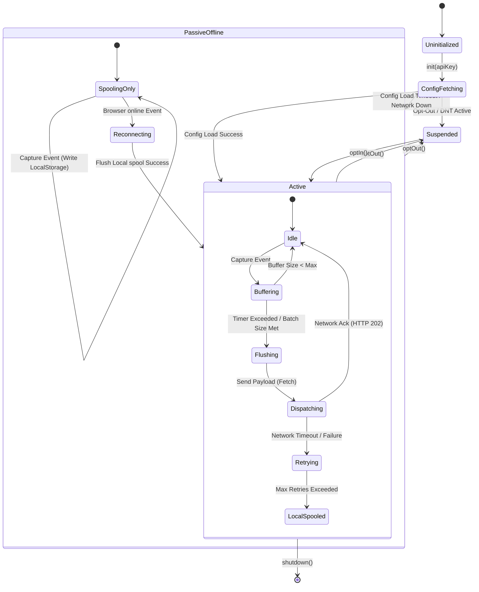
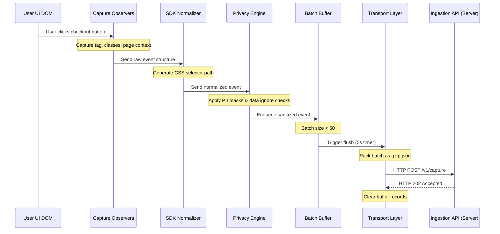

# InsightFuel — Universal SDK Functional Specification
**Version:** 1.0  
**Status:** Approved Reference  
**Audience:** Core SDK Engineers, Browser Integration Teams, DX Specialists, and Quality Assurance Engineers  

---

## 1. SDK Philosophy

The InsightFuel Universal Client-Side SDK (`@insightfuel/browser`) is built to reconcile developer experience (DX) with web application performance and user privacy.

```
                  +----------------------------------------------+
                  |               CORE SDK DESIGN                |
                  +-------+------------------------------+-------+
                          |                              |
                          | Non-Blocking                 | Data Protection
                          v                              v
           +--------------+---------------+      +-------+--------------+
           |        Zero Configuration    |      |    Privacy-by-Design |
           | - Auto-capture DOM clicks    |      | - Local PII scrubbing|
           | - Hook SPA route changes     |      | - Respect DNT header |
           +--------------+---------------+      +-------+--------------+
                          |                              |
           +--------------+---------------+              |
           | - Gzip Bundle Size < 15KB    | <------------+
           | - Queue events in-memory     |
           | - Flush via sendBeacon       |
           +------------------------------+
```

### 1.1 Core Principles

1.  **Zero Configuration Ingestion:**  
    Developers should not be forced to plan tracking schemas before integrating analytics. By executing a single `init()` call, the SDK starts tracking page navigation, button clicks, form submissions, and device metadata automatically.
2.  **Zero Main-Thread Degradation:**  
    The SDK must run off the main rendering path. We use asynchronous initialization loops, event delegation, and browser idle periods to ensure tracking does not delay page loads or cause UI lag.
3.  **Privacy-by-Design:**  
    PII detection and data scrubbing occur on the client device. Sensitive variables (such as credit card inputs, password fields, or custom attributes matching PII patterns) are scrubbed before they are queued for transmission.
4.  **Network Reliability:**  
    Uses a hybrid buffering model. Telemetry records are stored in memory and flushed in batches. If the client loses connection, events are written to local storage and resent when connection is restored.
5.  **Extensible Event Hooks:**  
    Provides hook interfaces that allow development teams to intercept events, attach custom properties, and filter payload structures before network dispatch.

---

## 2. SDK Public API

The SDK is compiled as a TypeScript module. Below are the public API method signatures and behavior specifications.

### 2.1 Configuration Schema Definition
```typescript
interface Config {
  autocapture?: boolean | {
    clicks?: boolean;
    forms?: boolean;
    scrolls?: boolean;
    views?: boolean;
    errors?: boolean;
    performance?: boolean;
  };
  respectDNT?: boolean;
  samplingRate?: number; -- Value between 0.0 and 1.0
  blacklistSelectors?: string[];
  properties?: Record<string, any>;
  apiHost?: string;
  debug?: boolean;
}
```

### 2.2 Public Method Signatures

#### 2.2.1 init()
*   **Signature:** `init(apiKey: string, config?: Config): void`
*   **Purpose:** Initializes the SDK instance, loads remote configuration settings, and starts auto-capture observers.
*   **Validation:** Throws an error if `apiKey` does not match the UUID structure.

#### 2.2.2 track()
*   **Signature:** `track(eventName: string, properties?: Record<string, any>): void`
*   **Purpose:** Enqueues a custom event.
*   **Constraints:** `eventName` is validated against naming rules (snake_case, length $\le 128$ characters).

#### 2.2.3 identify()
*   **Signature:** `identify(userId: string, userTraits?: Record<string, any>): void`
*   **Purpose:** Links the anonymous tracking session to a verified user account.
*   **Behavior:** Enqueues a `user_identified` lifecycle event. Pushes an alias mapping rule containing the active `anonymous_id` and the verified `userId` to the server.

#### 2.2.4 group()
*   **Signature:** `group(groupId: string, groupTraits?: Record<string, any>): void`
*   **Purpose:** Links the active user to a specific organization or group workspace.

#### 2.2.5 reset()
*   **Signature:** `reset(): void`
*   **Purpose:** Clears session data, deletes stored identity cookies, and generates a new anonymous `distinct_id`. Used during user logouts.

#### 2.2.6 page()
*   **Signature:** `page(pageName?: string, properties?: Record<string, any>): void`
*   **Purpose:** Manually logs a page view. Useful for custom route tracking in applications that do not use standard browser router APIs.

#### 2.2.7 feature()
*   **Signature:** `feature(featureKey: string, properties?: Record<string, any>): void`
*   **Purpose:** Manually records interactions with a feature.

#### 2.2.8 optIn()
*   **Signature:** `optIn(): void`
*   **Purpose:** Activates tracking. Generates active cookies and starts data capture observers.

#### 2.2.9 optOut()
*   **Signature:** `optOut(): void`
*   **Purpose:** Deactivates tracking. Deletes existing cookies and purges pending event buffers.

#### 2.2.10 setUser()
*   **Signature:** `setUser(userId: string): void`
*   **Purpose:** Assigns the active user ID without triggering a server-side alias merge.

#### 2.2.11 setProject()
*   **Signature:** `setProject(projectId: string): void`
*   **Purpose:** Dynamically changes the target workspace project ID for subsequent events.

#### 2.2.12 shutdown()
*   **Signature:** `shutdown(): void`
*   **Purpose:** Stops event observers, flushes pending event buffers via `sendBeacon`, and releases runtime memory allocations.

---

## 3. SDK Lifecycle & State Machine

The client SDK manages state transitions based on network conditions, browser status, and privacy settings.

### 3.1 SDK State Transition Diagram (Mermaid)



### 3.2 State Transition Matrix

| Current State | Event Trigger | Next State | Action Executed |
|---|---|---|---|
| **Uninitialized** | `init()` called | **ConfigFetching** | Read cookies; send configuration request to server |
| **ConfigFetching** | Configuration loaded | **Active** | Run event listeners; start background flush timer |
| **ConfigFetching** | Request timeout | **PassiveOffline**| Read configuration from cache; enable local storage spooling |
| **Active** | `optOut()` called | **Suspended** | Drop event listeners; delete cookies; purge buffers |
| **Active** | Event captured | **Buffering** | Run PII scrub; push event to in-memory queue |
| **Buffering** | Batch limit hit | **Flushing** | Compile event batch; generate network payload |
| **Flushing** | Payload sent | **Dispatching** | Dispatch payload using browser `fetch` API |
| **Dispatching** | HTTP 202 returned | **Idle** | Clear flushed events from memory; update offsets |
| **Dispatching** | Connection error | **Retrying** | Increment retry counter; calculate exponential backoff |
| **Retrying** | Max retries hit | **LocalSpooled** | Write event batch payload to `localStorage` |
| **PassiveOffline**| `online` event | **Reconnecting** | Read spooled payloads; start background flush |
| **Suspended** | `optIn()` called | **Active** | Regenerate tokens; start capture observers |

---

## 4. Auto Capture Engine

The Auto Capture engine monitors and captures user interactions without requiring manual code instrumentation.

### 4.1 Click Tracking
The SDK registers a single, non-blocking click listener on the `document` root. When a user clicks an element, the SDK uses event delegation to capture and process the interaction.
*   **Selector Resolution:** Traverses up the DOM tree from the click target (`event.target`) to resolve a stable CSS selector path.
*   **Text Capture:** Captures the text content of the clicked element (e.g., button text). The text is truncated to 64 characters and stripped of numbers to prevent PII leakage.

### 4.2 Form Submissions
Listens for submit events on form elements.
*   **Input Masking:** Captures form metadata (e.g., form ID, input element names) while ignoring input values to prevent PII leakage.
*   **Action Tracking:** Logs form submission attempts and matches input structures against configuration parameters.

### 4.3 Scroll Depth Tracking
Tracks user scroll depth using an `IntersectionObserver` on invisible sentinel elements, or by listening to scroll events:
*   **Checkpoints:** Logs events when the user scrolls past 25%, 50%, 75%, and 100% of the page height. The scroll listener is throttled to trigger once every 250 milliseconds.

### 4.4 Single-Page Application (SPA) Route Changes
Hooks into browser history interfaces to track page views in SPAs.
*   **History Hooks:** Overrides the browser's native `history.pushState` and `history.replaceState` methods.
*   **Listener Hooks:** Listens to `popstate` and `hashchange` events to capture route changes.

### 4.5 Additional Capture Orbits
*   **Window Visibility:** Listens to `visibilitychange` events. The SDK flushes pending event buffers when the page is hidden, or pauses session timers when the tab is inactive.
*   **Asset Downloads:** Captures clicks on elements with anchor tags containing file download extensions (e.g., `.pdf`, `.zip`, `.csv`).
*   **Outbound Links:** Tracks clicks on anchor tags pointing to domains different from the current window host.
*   **Clipboard Interactions:** Listens for `copy` and `cut` events, capturing the selector of the source element while ignoring the copied text content.

---

## 5. Feature Detection Engine

The Feature Detection engine processes client-side interactions to identify stable feature selectors for the Feature Registry.

### 5.1 Dynamic DOM Observation
The SDK uses a `MutationObserver` instance to monitor DOM changes. This allows the SDK to track interactions with dynamic elements (such as modals or dropdowns) that are added to the page after initial load.
*   **Batching Mutations:** To prevent performance degradation, DOM mutations are batched and processed during browser idle periods using `requestIdleCallback`.

### 5.2 Selector Generation Algorithm
The SDK generates a stable CSS selector path for clicked elements by traversing up the DOM hierarchy:
1.  **Unique Attributes:** If an element contains a `data-testid` or a unique `id`, the path resolution terminates: `button[data-testid="confirm-btn"]`.
2.  **Structural Classes:** If unique attributes are not present, the generator combines element tag names with stable structural class names: `div.pricing-card > button.btn-primary`.
3.  **Child Indices:** Falls back to child index paths if class names are dynamic or volatile: `div.container > form:nth-child(2) > input:nth-child(1)`.

### 5.3 Similarity Verification
The SDK compares generated element selectors against cached configurations:
*   **Lookup:** Clicked selectors are checked against the project feature cache in `localStorage`.
*   **Mapping:** If the selector matches a tracked feature configuration, the event is logged with the resolved feature key. If no match is found, the selector is registered as a new candidate feature.

---

## 6. Session Engine

The Session Engine groups user events into logical session blocks to calculate session duration and engagement metrics.

### 6.1 Session Creation & Boundary Rules
*   **Generation:** Generates a new UUIDv4 as `session_id` when the SDK initializes.
*   **Storage:** Stores the session ID in `sessionStorage` to isolate tracking context to the active browser tab.
*   **Cross-Tab Sync:** If a project requires cross-tab session tracking, the SDK writes the session ID to a cookie with a 30-minute expiration window. The SDK syncs the session ID across tabs by listening to storage events:
    ```javascript
    window.addEventListener('storage', (event) => {
      if (event.key === 'insightfuel_sync_session') {
         updateSessionId(event.newValue);
      }
    });
    ```

### 6.2 Idle Detection & Heartbeats
*   **Activity Monitoring:** The SDK monitors user activity by listening to `mousemove`, `keydown`, and `scroll` events.
*   **Timeout:** If no user activity is detected for 30 minutes, the session is marked expired.
*   **Heartbeat Event:** The SDK sends a `session_heartbeat` event every 60 seconds during active sessions to verify the user is online.

---

## 7. Identity Engine

The Identity Engine manages anonymous and identified user states to support identity resolution.

```
       [Visitor Enters Page] 
                 │
                 ▼
       [Check Cookies/Storage]
                 ├── Cookie Found ──> Load existing anonymous_id
                 └── No Cookie ─────> Generate anonymous_id (UUIDv4)
                                             │
                                             ▼
                                     [Session Events]
                                   (distinct_id = anon)
                                             │
                                             │ User logs in: identify("user_102")
                                             v
                                    [Merge Identifier]
                                   - Link anon to user_102
                                   - Set distinct_id = user_102
```

### 7.1 ID Mapping Strategy
1.  **Anonymous ID Generation:**  
    Generates a cryptographically strong UUIDv4 prefixed with `anon_` (e.g., `anon_9f1b2c3d`) on first load. The ID is stored in a cookie with a 365-day expiration window.
2.  **Identified ID Transition:**  
    When the application calls `identify("user_102")`:
    *   The SDK sets the `distinct_id` value to `user_102`.
    *   The SDK enqueues an identity mapping event to link `anon_9f1b2c3d` with `user_102` in database logs.
    *   The SDK sets the `distinct_id` value to `user_102`.
    *   The SDK enqueues an identity mapping event to link `anon_9f1b2c3d` with `user_102` in database logs.
3.  **Identity Reset:**  
    When the application calls `reset()` (e.g., on user logout):
    *   The SDK deletes the current user identity cookies.
    *   The SDK generates a new anonymous ID (`anon_...`) and session ID to isolate subsequent tracking from the previous session.

---

## 8. Buffer Engine

The Buffer Engine aggregates captured telemetry events in memory and manages batch flushing to optimize network requests.

```
       [Captured Event]
              │
              ▼
   +────────────────────+
   │   In-Memory Queue  │
   +──────────┬─────────+
              │
              ├── Queue reaches 50 events? ──> [Flush Ingestion]
              ├── 5 seconds elapsed? ────────> [Flush Ingestion]
              └── Window closed (unload)? ───> [Flush sendBeacon]
```

### 8.1 In-Memory Queue Operations
*   **Structure:** Events are stored as JSON elements in an array.
*   **Size Constraint:** The array is capped at 500 events to prevent memory leaks in long-running Single Page Applications. If the queue size exceeds this limit, the SDK drops incoming events and logs a warning in debug mode.

### 8.2 Flush Trigger Policies
1.  **Batch Size Limit:** The SDK triggers a flush when the memory queue reaches 50 events.
2.  **Time Threshold:** A background timer (using `setInterval`) flushes the queue every 5 seconds if new events are present.
3.  **Page Unload:** The SDK registers listeners for `visibilitychange` and `beforeunload` events. When the page is unloaded, the SDK flushes any remaining events using `navigator.sendBeacon` to prevent data loss.

---

## 9. Retry Engine

The Retry Engine handles network request failures and manages the local offline event spool.

### 9.1 Exponential Backoff Algorithm
When a batch flush fails (e.g., due to network timeout or client offline status), the SDK retries the request using exponential backoff with jitter:

$$T_{retry} = \min\left(2^{attempt} \cdot 1000\text{ms} + \text{random\_jitter}, 30000\text{ms}\right)$$

*   **Max Retries:** The SDK attempts up to 5 retries per batch. If all retries fail, the batch is written to the offline queue.

### 9.2 Offline Storage Spooling
*   **Medium:** Stores event payloads in the browser's `localStorage` under the key `insightfuel_offline_spool`.
*   **Format:** Batches are serialized as JSON strings.
*   **Cap Limits:** The offline queue is capped at 1,000 events. If the limit is reached, the SDK drops the oldest events (FIFO) to avoid exceeding browser storage quotas.
*   **Recovery Flow:** The SDK registers a listener for the browser `online` event. When connection is restored, a background worker drains the offline queue and sends the batches to the Ingestion API.

---

## 10. Privacy Engine

The Privacy Engine enforces user consent settings and scrubs sensitive data before transmission.

### 10.1 Consent Enforcement
*   **respectDNT Config:** When `respectDNT` is enabled, the SDK checks the browser's `navigator.doNotTrack` value. If it is set to `1`, the SDK disables tracking observers.
*   **Opt-In / Opt-Out States:** The SDK tracks consent status in a persistent cookie named `insightfuel_consent`. If consent is declined or revoked, the SDK halts all tracking, clears memory buffers, and deletes local tracking cookies.

### 10.2 Client-Side Data Scrubbing & Masking
To prevent PII leakage, the SDK scrubs form inputs and DOM text before enqueueing events:
1.  **Form Input Masking:** The SDK does not capture values from form input fields (e.g., `<input>`, `<textarea>`). It only records the tag name and name attributes.
2.  **Email Detection:** A regex filter scans custom event properties and replaces values matching email patterns with an SHA-256 hash.
3.  **Element-Level Ignores:** Developers can exclude elements from click tracking by adding the `data-insightfuel-ignore` attribute:
    ```html
    <button class="sensitive-btn" data-insightfuel-ignore>Reveal Password</button>
    ```

---

## 11. Performance Budget

To ensure the SDK does not impact host page performance, it operates within strict resource limits.

### 11.1 Resource & Execution Limits

| Metric Boundary Parameter | Maximum Budget Limit | Measurement Target |
|---|---|---|
| **Bundle Size (Gzipped)** | < 15 Kilobytes (KB) | Network load performance |
| **Active Memory Footprint** | < 10 Megabytes (MB) | Browser runtime heap size |
| **CPU Main-Thread Blocking** | < 50 milliseconds (ms) | Prevent UI thread blockages |
| **First Load Initialization** | < 100 milliseconds (ms) | Time to start tracking observers |
| **Network Request Size** | < 64 Kilobytes (KB) | Ingestion payload size |

---

## 12. Browser Compatibility

The SDK is compiled to target `ES6` output. It runs across major modern browsers, using fallback APIs to support older browser runtimes.

### 12.1 Compatibility Matrix & Fallbacks

| Target Browser | Minimum Version | Core Browser API | SDK Fallback Mechanism |
|---|---|---|---|
| **Google Chrome** | 61+ | `fetch()` | `XMLHttpRequest` |
| **Mozilla Firefox** | 60+ | `navigator.sendBeacon()` | Synchronous `fetch()` on unload |
| **Apple Safari** | 11.1+ | `IntersectionObserver` | Event throttled scroll tracking fallback |
| **Microsoft Edge** | 79+ | `requestIdleCallback()` | `setTimeout(callback, 50)` |

---

## 13. Framework Support

The client-side SDK provides wrapper modules to support integration with major frontend and server frameworks.

### 13.1 Frontend Wrappers

#### 13.1.1 React (`@insightfuel/react`)
*   **Component Provider:** Exposes the `<InsightFuelProvider>` context wrapper.
*   **React Hook:** Exposes the `useInsightFuel` hook to access tracking methods:
    ```javascript
    const { track } = useInsightFuel();
    ```

#### 13.1.2 Next.js (`@insightfuel/nextjs`)
*   **SSR Context:** Detects server-side rendering (SSR) environments and bypasses client tracking hooks until the application is mounted in the browser.
*   **Route Tracking:** Hooks into the Next.js `usePathname` and `useSearchParams` hooks to track SPA route transitions.

#### 13.1.3 Vue & Nuxt (`@insightfuel/vue`)
*   **Vue Plugin:** Installs as a global plugin, exposing routing bindings via Vue Router.

---

### 13.2 Server Middleware integrations

For server-side applications (Express, Django, Flask, Laravel, ASP.NET), InsightFuel acts as a request execution filter:
*   **Middleware Logic:** Registers as a server-side request middleware. It logs execution times and error states, sending performance and error events directly to the Ingestion API.

---

## 14. Event Pipeline

The diagram below illustrates the stages an event passes through from user interaction to database persistence.

### 14.1 Pipeline Trace Diagram (Mermaid)



### 14.2 Pipeline Flow (ASCII Representation)
```
[User Interaction] 
       │
       ▼
[DOM Event Listener] ──> Capture element attributes & values
       │
       ▼
[SDK Normalizer] ──────> Generate CSS selector path & add page parameters
       │
       ▼
[Privacy Engine] ──────> Apply element ignore attributes & mask PII fields
       │
       ▼
[Batch Buffer] ────────> Buffer events in memory (limit: 50 events)
       │
       ▼
[Network Client] ──────> Compress batch and dispatch using fetch / sendBeacon
       │
       ▼
[Ingestion API] ───────> Verify API Key and enqueue event batch
```

---

## 15. Error Handling & Exception Boundaries

The SDK implements exception containment blocks around all DOM hooks, event observers, and browser API wrappers to prevent runtime errors from propagating to the host application.

### 15.1 Runtime Exception Containment
*   **Safe Execution Wrappers:** Core operations (DOM event listeners, MutationObservers, and history hooks) are wrapped in `try/catch` statements:
    ```javascript
    try {
      executeTrackingObserver();
    } catch (error) {
      logErrorToDiagnostics(error);
    }
    ```
*   **Self-Disabling Logic:** If the SDK encounters 3 consecutive internal exceptions, it automatically disables all observers and releases runtime resources to protect the host application.

### 15.2 Ingest Blockages & Browser Restrictions
*   **Ad-Blocker Identification:** If the network request fails due to ad-blocker filters (indicated by blocked resource error states or specific tracking script blockage codes), the SDK pauses attempts to flush, spools subsequent records to `localStorage`, and retries at less frequent intervals.
*   **Cookie Blockage:** If browser settings disable cookies, the SDK falls back to tracking anonymous state using `sessionStorage` or in-memory variables.

---

## 16. SDK Configuration

The SDK configures its capture parameters dynamically during initialization.

### 16.1 Target Environments
*   `production`: Compiles logs using standard gzip compression and routes events to production API endpoints.
*   `development`: Disables compression, routes events to local sandbox endpoints, and prints diagnostics logs to the developer console.

### 16.2 Sampling Configurations
*   **Rate Limits:** Projects can configure sampling ratios between `0.0` (tracking disabled) and `1.0` (track all actions). The SDK evaluates the sampling rate during initialization and resolves eligibility using a hash of the user's `distinct_id` to ensure consistent tracking across sessions.

---

## 17. Security

Client security configurations enforce tenant validation and protect data transit paths.

### 17.1 Cross-Origin (CORS) Protections
*   **Origin Validation:** The Ingestion API enforces CORS policies, rejecting capture payloads if their HTTP `Origin` header does not match the domains registered in the project configuration.

### 17.2 API Key Restrictions
*   **Scope Isolation:** The SDK uses a write-only API key. Write keys only grant access to ingestion endpoints (`/v1/capture` and `/v1/identify`). Requests attempting to access query endpoints using a write key are blocked.

### 17.3 Replay Attack Protection
*   **Verification Offset:** The API Gateway validates incoming event batch payloads by checking event timestamps against server ingestion times. Payloads containing timestamps that deviate from the server time by more than 30 minutes are flagged as duplicate replays and rejected.

---

## 18. Testing Strategy

The SDK is tested across browsers and platforms to verify behavior under different workloads.

### 18.1 Testing Matrix Specifications

| Testing Phase | Scope | Methodology | Target Outcome |
|---|---|---|---|
| **Unit Testing** | Module-level tests | Jest, DOM simulators | 100% code coverage for normalizer and parser functions |
| **Browser Compatibility** | Cross-browser validations | Playwright, Webkit instances | Verifies behavior and fallback APIs across major browsers |
| **Performance Audit** | Resource footprint tests | Chrome DevTools Tracing | Verifies bundle sizes (<15KB) and main-thread execution limits (<50ms) |
| **Stress Testing** | High-frequency interaction tests | Playwright click loops | Verifies batch limits and memory queue thresholds |
| **Offline Verification** | Simulated connection loss | Chrome Network emulation | Verifies local storage spools and queue recovery |

---

## 19. Future SDK Implementations

The client-side specification serves as the architectural reference for future platform wrappers:

1.  **Mobile SDKs (React Native / Flutter):** Mobile SDKs wrap native storage APIs (SQLite, CoreData) to spool events during offline periods. They capture mobile-specific metadata (e.g., cell carrier, screen orientation) instead of User-Agent strings.
2.  **Desktop SDK (Electron):** Accesses Node storage loops to log desktop interactions, using local system APIs to check network availability.
3.  **Server-Side SDKs (Node, Python, Java, .NET):** Bypasses DOM tracking loops and registers as a request execution filter. They log execution performance and error states, sending events directly to the Ingestion API.

---

## 20. Engineering Decisions

This section details the technical choices and trade-offs made during the development of the client-side SDK.

### 20.1 Technical Trade-off Evaluations

#### 20.1.1 DOM Observation: MutationObserver vs. Polling Loops
*   **Polling Loops (Rejected):** Running periodic background sweeps (e.g., via `setInterval`) to inspect DOM elements is CPU-intensive. It can cause visible page layout lag and may miss interactions with short-lived elements.
*   **MutationObserver (Chosen):** MutationObserver provides event-driven hooks that trigger only when elements are added or removed from the DOM. This approach minimizes CPU usage and ensures the SDK captures interactions with dynamic elements.

#### 20.1.2 Transport API: Beacon API vs. Fetch API
*   **Beacon API (Chosen for Unload):** `navigator.sendBeacon` runs asynchronously in the background, allowing the browser to transmit events even after the page is closed. This prevents data loss during page transitions.
*   **Fetch API (Chosen for Active Session):** The `fetch` API is used during active sessions. It supports Gzip compression and handles server response codes, enabling the SDK to implement retry and backoff logic.

#### 20.1.3 Storage Type: LocalStorage vs. SessionStorage
*   **SessionStorage (Chosen for Session ID):** Exposes tab-level storage. Using `sessionStorage` to store the active `session_id` isolates tracking contexts across tabs, preventing data cross-contamination when users open multiple workspaces.
*   **LocalStorage (Chosen for Offline Queue):** LocalStorage persists data across browser sessions. It is used to store offline event spools, ensuring queued events are preserved when the browser is closed.

#### 20.1.4 Element Hooks: Event Delegation vs. Inline Observers
*   **Inline Observers (Rejected):** Attaching click listeners directly to individual elements is memory-intensive and can cause performance issues in applications with many interactive elements.
*   **Event Delegation (Chosen):** The SDK registers a single click listener on the `document` root. This approach handles interactions with dynamic elements automatically and keeps the SDK's memory footprint under 10MB.


