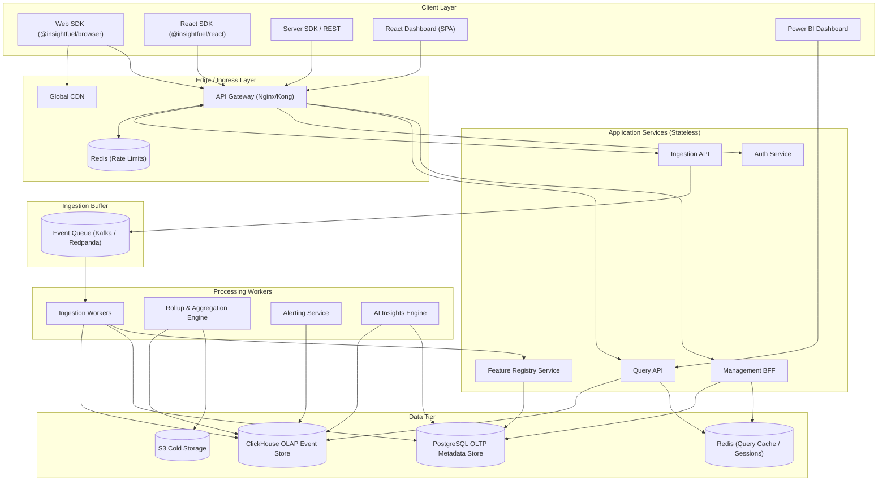
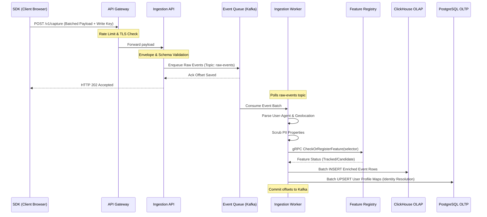
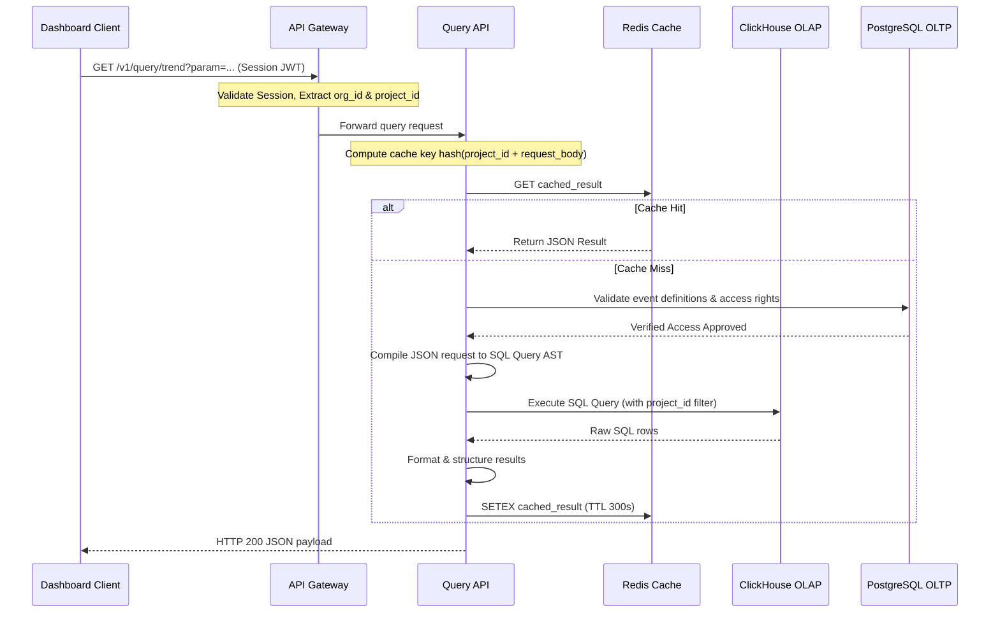
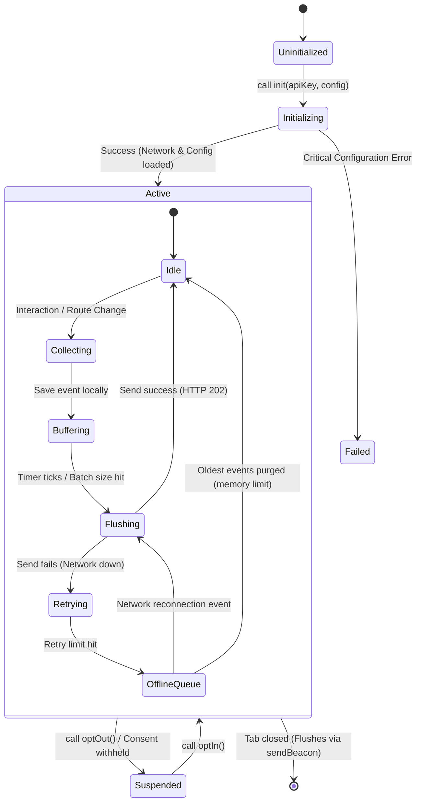
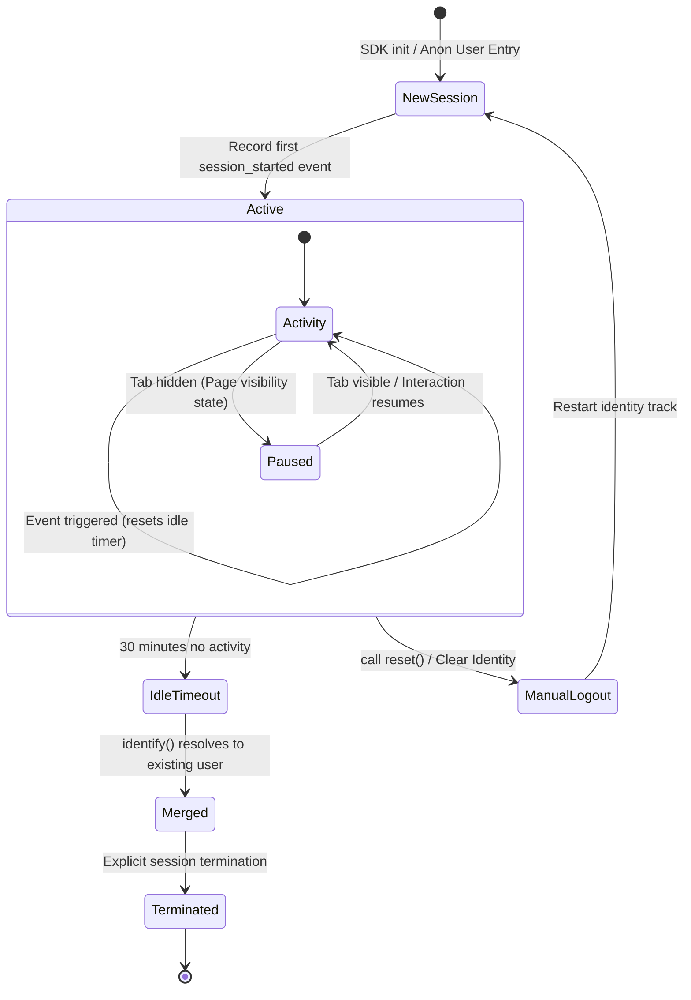
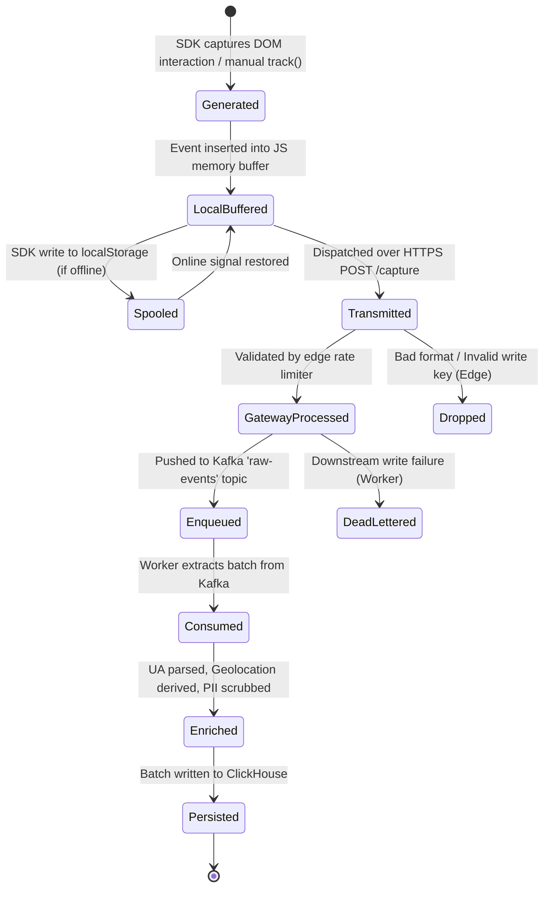

# InsightFuel — Technical Design Specification
**Version:** 1.0  
**Status:** Baseline Draft  
**Primary Author:** Principal Software Architect & Engineering Leadership Group  
**Target Audience:** Staff Engineers, Backend, Frontend, Data Platform, DevOps, and Security Teams  

---

## 1. Executive Summary

InsightFuel is a high-throughput, low-latency Product Intelligence & User Behavior Analytics Platform. The engineering goal is to provide a plug-and-play, zero-configuration solution that tracks, processes, and visualizes millions of events per day while generating real-time feature analytics, product health metrics, and automated AI insights.

### 1.1 Architectural Drivers
The system architecture is designed around four non-negotiable engineering requirements:
1. **Decoupled Write Path:** Event ingestion must be independent of query load. Under peak bursts, the write path guarantees delivery to a message broker, shielding downstream databases.
2. **Stateless Scalability:** Ingestion API, Query API, and Management BFF layers are completely stateless, scaling horizontally behind a load balancer.
3. **Multi-Tenant Structural Isolation:** Every database table, Redis cache key, queue message, and query scope must enforce a partition key based on a verified `project_id`.
4. **OLAP and OLTP Separation:** ClickHouse acts as the primary analytical event store, while PostgreSQL serves as the relational metadata store for transactional settings, auth, and schema registries.

### 1.2 Performance and Scalability Goals
The platform is built to sustain a baseline of 100 million events per day, with peak spikes up to 5,000 requests per second (RPS) on ingestion. The p95 response time for SDK ingestion is target-capped at < 50ms, while the p95 for dashboard queries spanning trailing 30-day windows is targeted at < 250ms.

---

## 2. Engineering Principles

Every engineer contributing to InsightFuel must adhere to the following principles:

1. **Write Path Isolation:** The client should receive a `202 Accepted` response as soon as an event is written to the ingestion buffer (Event Queue). No event writing should block on database execution.
2. **At-Least-Once Delivery with Read-Side Deduplication:** We choose eventual consistency over blocking transactions. Ingestion workers process events at-least-once. The storage engine and query layer deduplicate events based on a unique client-generated `event_id` and ingestion timestamps.
3. **No Unparameterized Queries:** Under no circumstances should ClickHouse or PostgreSQL queries be constructed using string concatenation. Dynamic filters must be processed through a structured query planner that compiles down to parameterized AST nodes.
4. **Fail-Safe Client Integration:** The SDK must never degrade host application performance. All operations must run asynchronously, using background memory loops and `navigator.sendBeacon` for unload states, with strict memory safety boundaries (caps on memory usage).
5. **Explainability Over Black-Box Logic:** Any composite score (e.g., Product Health Score) or automated recommendation must be decomposable into its constituent mathematical formulas and raw data points. Black-box outputs are treated as bugs.
6. **Data Minimization:** No raw PII (IP addresses, raw emails, personal names) may land in durable storage. Geolocation must be resolved at the edge, and IP addresses must be discarded prior to queuing.

---

## 3. High-Level Architecture

The following diagrams illustrate the end-to-end component layout of the InsightFuel platform, demonstrating the flow of data from client-side SDKs to the database and analytical dashboard surfaces.

### 3.1 Component Diagram (Mermaid)



### 3.2 High-Level Component Layout (ASCII Diagram)

```
+-----------------------------------------------------------------------------------+
|                                  CLIENT LAYER                                     |
|  [Web SDK]     [React SDK]     [Server SDK / REST]    [React UI]     [Power BI]   |
+-------+-------------+------------------+------------------+--------------+--------+
        |             |                  |                  |              |
        v             v                  v                  v              v
+-----------------------------------------------------------------------------------+
|                              EDGE / INGRESS LAYER                                 |
|                 [API Gateway]  <===================> [Redis Rate Limit Store]    |
+----------------------+------------------------------------------------------------+
                       |
                       +---------------+---------------+---------------+
                       |               |               |               |
                       v               v               v               v
+-----------------------------------------------------------------------------------+
|                        STATELESS APPLICATION SERVICES                             |
|    [Ingestion API]     [Auth Service]     [Query API]     [Management BFF]        |
|           |                                    |                 |                |
|           |                                    |    +------------+                |
|           v                                    v    v                             |
|  +-------------------+                    +----+----+----+   +-----------------+  |
|  |    EVENT QUEUE    |                    |  Redis Cache |   |Feature Registry |  |
|  | (Kafka /Redpanda) |                    +----+----+----+   +--------+--------+  |
|  +--------+----------+                         ^    ^                 |           |
+-----------|------------------------------------|----|-----------------|-----------+
            v                                    |    |                 |
+------------------------------------------------|----|-----------------|-----------+
|                          PROCESSING WORKERS    |    |                 |           |
|    [Ingestion Workers] ------------------------+----+                 |           |
|           |                                         |                 v           |
|           |                                         |        +--------+--------+  |
|           v                                         |        |   PostgreSQL    |  |
|    +------+------+                                  |        | Metadata Store  |  |
|    | ClickHouse  | <================================+        +-----------------+  |
|    | Event Store |                                                                |
|    +------+------+                                                                |
|           |                                                                       |
|           v                                                                       |
|    [Rollup Engine] --------> [S3 Cold Storage]                                    |
|    [Alerting Service]                                                             |
|    [AI Insights Engine]                                                           |
+-----------------------------------------------------------------------------------+
```

### 3.3 Feature Registry Component Design
The Feature Registry is a core architectural component that acts as a gatekeeper and taxonomy mapper. It is responsible for:
1. **Dynamic Schema Registration:** As events pass through ingestion workers, features not yet cataloged are captured as "candidate features" and logged to Postgres via the Feature Registry API.
2. **Selector Normalization:** Resolves raw DOM selectors or routing strings to clean canonical representations (e.g., matching a selector like `div#checkout-btn > span` to a registered feature named `checkout_button`).
3. **Display Mapping:** Provides an interface for the Management BFF to let product managers assign human-readable labels to auto-discovered feature elements.
4. **Event Deduplication Scoping:** Ingests events and validates them against the registered feature list to prevent database pollution by erratic random DOM clicks.

---

## 4. Service Responsibilities, Performance Targets, & Communication Contracts

### 4.1 Service Definitions

#### 4.1.1 API Gateway
*   **Purpose:** Exposes public endpoints, routes requests, terminates SSL, validates authentication, and handles rate limiting.
*   **Inputs:** All incoming client requests (HTTP/HTTPS).
*   **Outputs:** Routed internal HTTP requests to backend microservices.
*   **Dependencies:** Redis (for rate-limit buckets).
*   **Failure Handling:** Falls back to downstream circuit breakers. If Redis is down, defaults to local in-memory rate limiting with relaxed limits.
*   **Scaling Strategy:** Horizontally scales CPU-bound pods via Kubernetes Horizontal Pod Autoscaler (HPA) targeting 70% CPU usage.
*   **Technology Choice:** Nginx/Kong (Lua scripts). High throughput and native integration with Redis.
*   **Performance Target:** p95 latency < 5ms, capacity of 20,000 concurrent connections per pod.
*   **Scalability Objective:** Seamless scale up from 2 to 20 nodes within 120 seconds.

#### 4.1.2 Ingestion API
*   **Purpose:** Accepts event batches, validates format schemas, and pushes raw payloads directly to the event broker.
*   **Inputs:** POST payloads representing batches of client events containing Write API keys.
*   **Outputs:** HTTP 202 status code to the client; Kafka message enqueue.
*   **Dependencies:** Kafka / Redpanda Cluster.
*   **Failure Handling:** If the Kafka cluster is unreachable, buffers events into a local disk-backed temporary spool (using a local LevelDB / SQLite instance running on the pod) and retries. Returns HTTP 503 only when local buffer limits are exceeded.
*   **Scaling Strategy:** Scale horizontally based on incoming HTTP request rate (HPA target: 800 requests/sec per pod).
*   **Technology Choice:** Go (Golang) / Fastify. Lightweight execution context, fast JSON parsing, and rapid network dispatch.
*   **Performance Target:** p99 ingestion latency < 25ms, memory footprint < 100MB under load.
*   **Scalability Objective:** Target scaling up to 100,000 requests/sec with horizontal node provisioning.

#### 4.1.3 Ingestion Workers
*   **Purpose:** Consumes raw event payloads, executes transformations, parses user-agent metadata, resolves IP-based geolocation, scrubs PII, checks candidate features against the Feature Registry, and writes to ClickHouse.
*   **Inputs:** Event records from Kafka partitions.
*   **Outputs:** Enriched SQL batches to ClickHouse; Identity mapping commands to PostgreSQL.
*   **Dependencies:** Kafka, PostgreSQL, ClickHouse, Feature Registry.
*   **Failure Handling:** Failed database writes trigger retry mechanisms (exponential backoff with jitter). If failures persist, events are redirected to a Dead Letter Queue (DLQ) in Kafka to prevent stream stalling.
*   **Scaling Strategy:** Scale workers based on consumer lag metrics (HPA trigger: queue consumer lag > 10,000 events).
*   **Technology Choice:** Node.js (TypeScript) or Go. Node provides rich libraries for parsing (UAParser, MaxMind GeoIP), while Go offers memory efficiency. Node is chosen for rapid iteration of parsing libraries.
*   **Performance Target:** Processing throughput of 8,000 events/sec per worker pod, p95 lag < 1.5 seconds.
*   **Scalability Objective:** Linearly scalable execution capacity tied directly to Kafka partition count.

#### 4.1.4 Query API
*   **Purpose:** Validates analytical dashboard requests, compiles structured parameters into optimal ClickHouse queries, manages permissions, and caches analytical outputs.
*   **Inputs:** Structured JSON query parameters (trend, funnel, retention definitions).
*   **Outputs:** JSON data shapes optimized for charts.
*   **Dependencies:** ClickHouse, PostgreSQL, Redis.
*   **Failure Handling:** Serves stale cached results from Redis if ClickHouse queries time out. Returns a degraded response with clear indicators of stale status.
*   **Scaling Strategy:** HPA based on CPU usage and database response times.
*   **Technology Choice:** Go. Offers high execution speed for parsing and strong database pooling capabilities.
*   **Performance Target:** p95 query latency < 150ms for cached hits, < 800ms for raw ClickHouse scans spanning 100 million rows.
*   **Scalability Objective:** Handle 500 concurrent analytical requests per node.

#### 4.1.5 Feature Registry Service
*   **Purpose:** Maintains the catalog of candidate and active features, mapping raw events to product hierarchy.
*   **Inputs:** Registration requests from workers; management requests from BFF.
*   **Outputs:** Relational mappings of features, query filters.
*   **Dependencies:** PostgreSQL, Redis (Metadata Cache).
*   **Failure Handling:** Internal caching isolates PostgreSQL. If PostgreSQL is down, the service operates read-only using cached mappings.
*   **Scaling Strategy:** Scale horizontally behind Gateway.
*   **Technology Choice:** Node.js / Express. Shared code models with workers.
*   **Performance Target:** Feature lookup response time < 5ms via Redis caching.
*   **Scalability Objective:** Store up to 500,000 distinct feature mappings per tenant.

### 4.2 Internal Service Communication Contracts

Services communicate internally over gRPC (for synchronous, low-latency lookups) or JSON-over-HTTP (fallback). Below are the primary service contracts.

#### 4.2.1 Ingestion to Feature Registry Service (gRPC Protocol Buffer)
```protobuf
syntax = "proto3";
package insightfuel.registry;

service FeatureRegistry {
  rpc CheckOrRegisterFeature (FeatureRequest) returns (FeatureResponse);
}

message FeatureRequest {
  string project_id = 1;
  string selector = 2;
  string page_url = 3;
  string event_name = 4;
}

message FeatureResponse {
  string feature_id = 1;
  enum Status {
    CANDIDATE = 0;
    TRACKED = 1;
    SUPPRESSED = 2;
  }
  Status status = 2;
  string display_name = 3;
}
```

#### 4.2.2 Query API to ClickHouse (Native Client Contract)
All analytical queries must append the tenant context as a query setting.
```json
{
  "query": "SELECT count() FROM events WHERE project_id = {project_id:String} AND timestamp >= {start:DateTime} AND timestamp <= {end:DateTime} GROUP BY event_name",
  "params": {
    "project_id": "proj_1a2b3c4d",
    "start": "2026-07-01 00:00:00",
    "end": "2026-07-07 23:59:59"
  },
  "settings": {
    "max_execution_time": 10,
    "max_memory_usage": 10000000000
  }
}
```

---

## 5. Data Flow, Sequence Diagrams, & State Machines

### 5.1 Ingestion Pipeline (Write Path)

#### 5.1.1 Sequence Diagram (Mermaid)



#### 5.1.2 ASCII Sequence representation (Write Path)
```
[Client SDK]     [API Gateway]     [Ingestion API]       [Kafka Queue]     [Workers]       [Databases]
     |                 |                  |                    |               |                |
     |-- POST /capture |                  |                    |               |                |
     |   (Payload) --->|                  |                    |               |                |
     |                 |-- Forward ------>|                    |               |                |
     |                 |                  |-- Enqueue Payload >|               |                |
     |                 |                  |   (raw-events)     |               |                |
     |                 |                  |<-- Offset Ack -----|               |                |
     |<-- HTTP 202 ----|<-- HTTP 202 -----|                    |               |                |
     |   Accepted      |   Accepted       |                    |               |                |
     |                 |                  |                    |               |                |
     |                 |                  |                    |-- Poll ------>|                |
     |                 |                  |                    |   Events      |                |
     |                 |                  |                    |--- Deliver -->|                |
     |                 |                  |                    |               |-- Parse, Scrub |
     |                 |                  |                    |               |   & Enrich     |
     |                 |                  |                    |               |                |
     |                 |                  |                    |               |-- Batch Write >|
     |                 |                  |                    |               |   (OLAP & OLTP)|
     |                 |                  |                    |               |<-- DB Ack -----|
```

### 5.2 Query Pipeline (Read Path)

#### 5.2.1 Sequence Diagram (Mermaid)



#### 5.2.2 ASCII Sequence representation (Read Path)
```
[Dashboard UI]       [API Gateway]       [Query API]         [Redis Cache]       [ClickHouse DB]
      |                    |                  |                    |                    |
      |-- GET /v1/query -->|                  |                    |                    |
      |                    |-- Forward ------>|                    |                    |
      |                    |                  |-- Check Cache ---->|                    |
      |                    |                  |<-- Cache Hit ------|                    |
      |                    |                  |                    |                    |
      |                    |                  | [Cache Miss Flow]  |                    |
      |                    |                  |-- Compile SQL ------------------------->|
      |                    |                  |<-- Return Rows -------------------------|
      |                    |                  |-- Store Cache ---->|                    |
      |<-- Return JSON ----|<-- Return JSON --|                    |                    |
```

### 5.3 Lifecycles & State Machine Diagrams

#### 5.3.1 SDK Lifecycle State Machine


**SDK Lifecycle ASCII representation:**
```
+------------------+     init()     +--------------+     Success      +------------+
|  Uninitialized   | -------------> | Initializing | ------------->  |   Active   |
+------------------+                +-------+------+                 +-----+------+
                                            |                              |
                                            | Error                        | optOut()
                                            v                              v
                                    +-------+------+                 +-----+------+
                                    |    Failed    |                 | Suspended  |
                                    +--------------+                 +------------+
```

#### 5.3.2 Session Lifecycle State Machine


#### 5.3.3 Event Lifecycle State Machine


---

## 6. SDK Internal Architecture

The client-side SDK (`@insightfuel/browser`) is designed as a modular, event-driven engine. It loads asynchronously, wraps the browser runtime safely, and manages memory and network limits to ensure it does not impact host page execution.

### 6.1 SDK Modular Architecture (ASCII Layout)

```
+-----------------------------------------------------------------------------------------+
|                                  PUBLIC SDK INTERFACE                                   |
|                             [init()]   [track()]   [identify()]                         |
+------------------------------------+-----------------------+----------------------------+
                                     |                       |
                                     v                       v
+-----------------------------------------------------------------------------------------+
|                                    CAPTURE ENGINE                                       |
|  +--------------------+  +--------------------+  +-------------------+  +------------+  |
|  |    DOM Observer    |  |   Route Observer   |  | Performance Track |  |Error Track |  |
|  +---------+----------+  +---------+----------+  +---------+---------+  +-----+------+  |
|            |                       |                       |                  |         |
|            +-----------------------+-------+---------------+------------------+         |
|                                            v                                            |
|                                  +-------------------+                                  |
|                                  |  Event Collector  |                                  |
|                                  +---------+---------+                                  |
+--------------------------------------------|--------------------------------------------+
                                             v
+-----------------------------------------------------------------------------------------+
|                                     STATE ENGINE                                        |
|  +--------------------+  +--------------------+  +-------------------+                  |
|  |   Session Manager  |  |  Consent Manager   |  |   Config Manager  |                  |
|  +--------------------+  +--------------------+  +-------------------+                  |
+--------------------------------------------|--------------------------------------------+
                                             v
+-----------------------------------------------------------------------------------------+
|                                  BUFFER & DISPATCH TIER                                 |
|                                  +---------+---------+                                  |
|                                  |   Batch Manager   |                                  |
|                                  +---------+---------+                                  |
|                                            |                                            |
|                        +-------------------+-------------------+                        |
|                        | (Online)                              | (Offline)              |
|                        v                                       v                        |
|              +-------------------+                   +-------------------+              |
|              |   Retry Engine    |                   |   Offline Queue   |              |
|              +---------+---------+                   |  (LocalStorage)   |
|                        |                             +-------------------+              |
|                        v                                                                |
|                  [fetch/Beacon]                                                         |
+-----------------------------------------------------------------------------------------+
```

### 6.2 Module Descriptions

#### 6.2.1 Event Collector
The central collector constructs the standard event envelope. It aggregates environmental context (User Agent, viewport, device orientation, OS details, screen resolution, locale, page title, URL) and merges it with specific payload schemas.
*   **Safety Boundary:** Strips any values matching potential query parameters containing auth tokens or credentials before event assembly.

#### 6.2.2 Session Manager
Responsible for maintaining session state across tabs and navigation changes.
*   **Mechanics:** Generates a cryptographically strong UUIDv4 as `session_id`. It stores the ID in a transient `sessionStorage` key. If no interaction is observed for 30 minutes, it marks the session expired, issues a new `session_id`, and fires a `session_ended` followed by a `session_started` event.

#### 6.2.3 Route Observer
Hooks into browser navigation changes.
*   **Mechanics:** Overrides the native `history.pushState` and `history.replaceState` prototypes, and listens to the `popstate` and `hashchange` window events. This guarantees automatic route tracking in Single Page Applications (SPAs) without requiring developer hooks.

#### 6.2.4 DOM Observer
Auto-discovers and registers interaction candidates.
*   **Mechanics:** Attaches non-blocking event listeners to the `document` node for `click`, `submit`, and `change` events. It uses event delegation to capture interactions.
*   **Selector Logic:** Resolves clicked elements to a stable selector by traversing up the DOM tree (checking for `data-testid`, `id`, `name`, and falling back to a structured index-based selector path: e.g., `div.container > form:nth-child(2) > button.submit`).

#### 6.2.5 Batch Manager
Buffers generated events in memory to optimize network usage.
*   **Mechanics:** Pushes events into an in-memory queue. It triggers a flush sequence when: (a) the queue size reaches 50 events, (b) 5 seconds have elapsed since the last flush, or (c) the browser signals an unload event (listens to `visibilitychange` and triggers a flush using `navigator.sendBeacon` if the page is hidden).

#### 6.2.6 Offline Queue
Prevents data loss during network disruptions.
*   **Mechanics:** Writes in-memory batches to a dedicated key in `localStorage` when network queries fail.
*   **Cap Limits:** Hard-capped at 1,000 events. If the limit is breached, the queue drops the oldest events (FIFO) to avoid exceeding browser storage quotas.

#### 6.2.7 Retry Engine
Handles connection re-establishment attempts.
*   **Mechanics:** Retries failed flushes using exponential backoff with jitter.
*   *Algorithm:* $T_{retry} = 2^{attempt} \times 1000\text{ms} + \text{random\_jitter}$. Max retry count is capped at 5 attempts per batch lifecycle.

#### 6.2.8 Consent Manager
Enforces user privacy settings at the source.
*   **Mechanics:** Evaluates browser `navigator.doNotTrack` status. Respects local `optIn()` and `optOut()` configurations. If consent is withheld or retracted, the tracker halts all capture hooks, clears memory buffers, and deletes local tracking cookies/storage items.

#### 6.2.9 Configuration Manager
Fetches and caches initialization parameters.
*   **Mechanics:** Periodically downloads (and caches in `localStorage` for 24 hours) the remote configuration file from the SDK service, mapping project-specific parameters (autocapture flags, IP resolution overrides, and event sampling rates).

#### 6.2.10 Performance Tracker
Measures page loading and client latency metrics.
*   **Mechanics:** Utilizes the browser `PerformanceObserver` API. It captures `navigation` and `resource` timings, compiling them into metrics for Core Web Vitals: First Input Delay (FID), Largest Contentful Paint (LCP), and Cumulative Layout Shift (CLS).

#### 6.2.11 Error Tracker
Captures unhandled errors that occur during runtime.
*   **Mechanics:** Hooks into the global `window.onerror` and `window.onunhandledrejection` handlers. It parses error stack traces, extracts error names, line numbers, and file sources, and packages them as `Error Events` (Section 6.3.6).

---

### 6.3 Event Data Contracts

The platform processes 8 specific event types. Below are the JSON schema payload contracts.

#### 6.3.1 Navigation Event
```json
{
  "event_id": "evt_1a2b3c4d5e6f7g8h",
  "event_name": "route_change",
  "category": "navigation",
  "distinct_id": "usr_99f2b1a8",
  "project_id": "proj_abc123",
  "timestamp": "2026-07-13T14:35:00.000Z",
  "properties": {
    "from_path": "/dashboard/home",
    "to_path": "/settings/billing",
    "transition_type": "pushState",
    "route_params": { "tab": "billing" }
  },
  "context": {
    "url": "https://app.insightfuel.com/settings/billing",
    "referrer": "https://app.insightfuel.com/dashboard/home",
    "session_id": "sess_883011a0c"
  }
}
```

#### 6.3.2 Feature Event
```json
{
  "event_id": "evt_9988776655443322",
  "event_name": "feature_used:export_billing_pdf",
  "category": "feature",
  "distinct_id": "usr_99f2b1a8",
  "project_id": "proj_abc123",
  "timestamp": "2026-07-13T14:35:10.000Z",
  "properties": {
    "selector": "button#export-pdf-btn",
    "page_context": "/settings/billing",
    "interaction_type": "click",
    "feature_label": "Export Billing Invoice"
  },
  "context": {
    "url": "https://app.insightfuel.com/settings/billing",
    "session_id": "sess_883011a0c"
  }
}
```

#### 6.3.3 User Event
```json
{
  "event_id": "evt_5544332211009988",
  "event_name": "user_identified",
  "category": "user",
  "distinct_id": "usr_99f2b1a8",
  "project_id": "proj_abc123",
  "timestamp": "2026-07-13T14:35:15.000Z",
  "properties": {
    "anonymous_id": "anon_xyz98765",
    "traits": {
      "email": "user@example.com",
      "company_name": "Acme Corp",
      "plan": "premium"
    }
  },
  "context": {
    "url": "https://app.insightfuel.com/login",
    "session_id": "sess_883011a0c"
  }
}
```

#### 6.3.4 Session Event
```json
{
  "event_id": "evt_0011223344556677",
  "event_name": "session_started",
  "category": "session",
  "distinct_id": "usr_99f2b1a8",
  "project_id": "proj_abc123",
  "timestamp": "2026-07-13T14:34:55.000Z",
  "properties": {
    "session_duration_s": 0,
    "entry_url": "https://app.insightfuel.com/dashboard/home",
    "referrer": "https://google.com/search"
  },
  "context": {
    "url": "https://app.insightfuel.com/dashboard/home",
    "session_id": "sess_883011a0c"
  }
}
```

#### 6.3.5 Performance Event
```json
{
  "event_id": "evt_7766554433221100",
  "event_name": "page_performance",
  "category": "performance",
  "distinct_id": "usr_99f2b1a8",
  "project_id": "proj_abc123",
  "timestamp": "2026-07-13T14:35:05.000Z",
  "properties": {
    "dom_interactive_ms": 350,
    "page_load_time_ms": 780,
    "largest_contentful_paint_ms": 920,
    "first_input_delay_ms": 12,
    "cumulative_layout_shift": 0.05
  },
  "context": {
    "url": "https://app.insightfuel.com/dashboard/home",
    "session_id": "sess_883011a0c"
  }
}
```

#### 6.3.6 Error Event
```json
{
  "event_id": "evt_aabbccddeeff0011",
  "event_name": "js_exception",
  "category": "error",
  "distinct_id": "usr_99f2b1a8",
  "project_id": "proj_abc123",
  "timestamp": "2026-07-13T14:36:20.000Z",
  "properties": {
    "error_message": "Cannot read property 'undefined' of null",
    "error_stack": "TypeError: Cannot read property 'undefined' of null\n    at InvoiceView.render (https://app.insightfuel.com/assets/app.js:452:12)",
    "file_source": "app.js",
    "line_number": 452
  },
  "context": {
    "url": "https://app.insightfuel.com/settings/billing",
    "session_id": "sess_883011a0c"
  }
}
```

#### 6.3.7 Business Event
```json
{
  "event_id": "evt_ffeeeeddddccccbb",
  "event_name": "checkout_completed",
  "category": "business",
  "distinct_id": "usr_99f2b1a8",
  "project_id": "proj_abc123",
  "timestamp": "2026-07-13T14:37:00.000Z",
  "properties": {
    "transaction_id": "tx_abc7762",
    "amount": 99.00,
    "currency": "USD",
    "items_count": 1
  },
  "context": {
    "url": "https://app.insightfuel.com/checkout/success",
    "session_id": "sess_883011a0c"
  }
}
```

#### 6.3.8 System Event
```json
{
  "event_id": "evt_9900112233445566",
  "event_name": "sdk_flush_triggered",
  "category": "system",
  "distinct_id": "usr_99f2b1a8",
  "project_id": "proj_abc123",
  "timestamp": "2026-07-13T14:37:05.000Z",
  "properties": {
    "batch_size": 15,
    "flush_trigger": "timer_ticks",
    "queue_remaining": 0
  },
  "context": {
    "url": "https://app.insightfuel.com/dashboard/home",
    "session_id": "sess_883011a0c"
  }
}
```

---

## 7. Backend Architecture

InsightFuel's backend architecture is designed as a suite of highly focused microservices that decouple the operational ingest pipeline from database query processing.

### 7.1 Core Backend Services

#### 7.1.1 API Gateway (Edge Proxy)
Exposes the central domain endpoints. Authenticates write actions via API keys and validates user session tokens (JWTs) before forwarding traffic to target application services.
*   **Security Context Resolution:** Inspects the request path and parameters to extract user identity and mapping scopes. Injects `project_id` and `org_id` parameters into standard downstream request headers (`X-InsightFuel-Project-ID`, `X-InsightFuel-Org-ID`).

#### 7.1.2 Authentication Service
Manages authentication credentials and role assignments.
*   **Session Management:** Issues stateless JSON Web Tokens (JWTs) for authenticated dashboard users containing a user's ID, organization ID, and role structure. Exposes standard OAuth endpoints.
*   **RBAC Matrix:** Enforces validation policies matching the four system roles: Owner, Admin, Analyst, and Viewer.

#### 7.1.3 Project Service
Provides CRUD configuration capabilities for tenant workspaces.
*   **Workspace Configs:** Manages settings records (data retention lengths, PII hashing policies, custom integration hooks) stored in PostgreSQL.

#### 7.1.4 SDK Service
Hosts static client packages and dynamically maps configuration parameters to active SDK nodes.
*   **Config Distribution:** Evaluates project requirements and exposes endpoints serving configuration flags (such as enabling automatic tracking and defining target sample ratios).

#### 7.1.5 API Key Service
Manages the registration and verification of write-only and read-only credentials.
*   **Storage & Caching:** Saves keys in PostgreSQL and populates a Redis cache index to support validation checks at the API Gateway within single-digit milliseconds.

#### 7.1.6 Query Service
Backs the analytical user interfaces.
*   **Query Planning:** Implements the query planning processor that converts incoming request parameters into ClickHouse SQL, ensuring tenant-isolation parameters are always included.

#### 7.1.7 Insights Service
Coordinates scheduled evaluations of historical event logs to trigger alerts and suggestions.
*   **ML & Rule Runners:** Runs scheduled workers that analyze raw metrics to evaluate anomalies and post updates to the automated recommendations feed.

#### 7.1.8 Admin Service
Supports internal system settings modifications.
*   **Billing & Support:** Handles tenant level usage counts, limits validation checks, and processes administrative overrides.

#### 7.1.9 Health Service
Proactively monitors system service levels.
*   **Coordination:** Checks dependency availability (PostgreSQL, ClickHouse, Redis, Kafka) and reports service status to internal cluster controllers.

---

## 8. Database Design

InsightFuel divides data storage based on access patterns, scaling needs, and transactional requirements.

```
                  +----------------------------------------------+
                  |                 DATA ROUTER                  |
                  +-------+------------------------------+-------+
                          |                              |
                          | Transactional                | High-Volume OLAP
                          v                              v
           +--------------+---------------+      +-------+--------------+
           |          PostgreSQL          |      |      ClickHouse      |
           |     (Relational Metadata)    |      | (Columnar Telemetry) |
           +--------------+---------------+      +-------+--------------+
                          |                              |
           +--------------+---------------+              |
           | - Users & Teams (RBAC)       |              |
           | - Projects & Environments    |              v
           | - Feature Registry Mappings  |      +-------+--------------+
           | - Security Audit Logs        |      | - Raw Event Store    |
           +------------------------------+      | - Aggregation Tables |
                                                 | - Materialized Views |
                                                 +----------------------+
```

### 8.1 PostgreSQL Relational Metadata Schema (OLTP)

PostgreSQL holds the transactional records where strict foreign key relationships, ACID consistency, and relational indices are required.

#### 8.1.1 PostgreSQL Schema Mapping
```
+---------------------------------------------------------------------------------------+
|                                     ORGANIZATIONS                                     |
|  PK  id                  UUIDv4                                                       |
|      name                VARCHAR(255) NOT NULL                                        |
|      plan_tier           VARCHAR(50) DEFAULT 'free'                                   |
|      created_at          TIMESTAMP WITH TIME ZONE DEFAULT NOW()                       |
+---------------------------------------------------------------------------------------+
                                   | (1)
                                   |
                                   | (N)
+---------------------------------------------------------------------------------------+
|                                       PROJECTS                                        |
|  PK  id                  UUIDv4                                                       |
|  FK  org_id              UUIDv4 NOT NULL REFERENCES organizations(id)                |
|      name                VARCHAR(255) NOT NULL                                        |
|      retention_days      INTEGER DEFAULT 90                                           |
|      pii_scrub_rules     JSONB DEFAULT '{}'::jsonb                                    |
|      created_at          TIMESTAMP WITH TIME ZONE DEFAULT NOW()                       |
+---------------------------------------------------------------------------------------+
         | (1)                                                     | (1)
         |                                                         |
         | (N)                                                     | (N)
+--------v----------------------------------------------+  +--------v-------------------+
|                   FEATURE_REGISTRY                    |  |             API_KEYS       |
|  PK  id            UUIDv4                             |  |  PK  id            UUIDv4  |
|  FK  project_id    UUIDv4 REFERENCES projects(id)     |  |  FK  project_id    UUIDv4  |
|      feature_key   VARCHAR(255) NOT NULL              |  |      key_hash      VARCHAR |
|      display_name  VARCHAR(255)                       |  |      key_type      VARCHAR |
|      status        VARCHAR(50) DEFAULT 'candidate'    |  |      created_at    TIMESTZ |
|      first_seen    TIMESTAMP WITH TIME ZONE           |  +----------------------------+
+-------------------------------------------------------+
```

### 8.2 ClickHouse Analytical Event Schema (OLAP)

ClickHouse serves as the primary OLAP event store. Events are saved into a single partitioned, columnar table that leverages compression codecs.

#### 8.2.1 Primary Events Table Definition
The table is built using the `ReplacingMergeTree` engine. This engine facilitates read-side deduplication by resolving events based on `event_id` and keeping the row with the largest `ingested_at` timestamp.

*   **Sorting Key (PRIMARY KEY):** `(project_id, timestamp, event_name, distinct_id)`  
    This ordering aligns queries to run index scans on `project_id` and specific time ranges.
*   **Partition Key:** `toYYYYMM(timestamp)`  
    Organizes event rows into monthly file blocks. This setup speeds up dropping data that falls outside a tenant's retention window.

#### 8.2.2 Table Layout & Compression Settings

| Column Name | Data Type | Encoding / Codec | Purpose |
|---|---|---|---|
| `project_id` | `UUID` | `LZ4` | Tenant partition boundary identifier |
| `event_id` | `String` | `LZ4` | Client-generated event UUID |
| `event_name` | `LowCardinality(String)` | `LZ4` | Event descriptor (re-uses dictionary index) |
| `category` | `LowCardinality(String)` | `LZ4` | System taxonomy classification |
| `distinct_id` | `String` | `LZ4` | Core tracking identifier |
| `timestamp` | `DateTime64(3, 'UTC')` | `DoubleDelta, LZ4` | Event occurrence timestamp |
| `ingested_at` | `DateTime` | `DoubleDelta, LZ4` | Ingestion timestamp used for deduplication |
| `properties` | `Map(String, String)` | `ZSTD(1)` | Flexible payload attributes |
| `properties_num` | `Map(String, Float64)` | `ZSTD(3)` | Fast numerical properties (prices, counts) |
| `context_url` | `String` | `ZSTD(1)` | Source URL |
| `context_os` | `LowCardinality(String)` | `LZ4` | Detected Operating System |
| `context_browser` | `LowCardinality(String)` | `LZ4` | Detected Client Browser |
| `session_id` | `String` | `LZ4` | Client session identifier |

#### 8.2.3 ClickHouse Materialized Views (Rollup Optimization)
To maintain fast dashboard render times under heavy data volumes, the system avoids recalculating daily active counts from raw tables on every page load. It utilizes ClickHouse materialized views to update summary tables incrementally during writes.

##### Daily Event Rollups View
```sql
CREATE MATERIALIZED VIEW daily_event_rollups_mv
TO daily_event_rollups
AS SELECT
    project_id,
    toStartOfDay(timestamp) AS day,
    event_name,
    countState() AS total_events,
    uniqState(distinct_id) AS unique_users
FROM events
GROUP BY project_id, day, event_name;
```

### 8.3 Redis Caching Strategy

The Redis tier handles high-frequency read caches and fast data storage pipelines.

```
                      +-----------------------------+
                      |       REDIS INSTANCE        |
                      +--------------+--------------+
                                     |
         +---------------------------+---------------------------+
         |                           |                           |
         v                           v                           v
+--------+--------+         +--------+--------+         +--------+--------+
|  QUERY CACHING  |         |   RATE LIMITS   |         |  AUTH SESSIONS  |
| - Key: md5 hash |         | - Key: limits   |         | - Key: sess_id  |
| - TTL: 300s     |         | - TTL: 60s      |         | - TTL: 24 Hours |
+-----------------+         +-----------------+         +-----------------+
```

1.  **Query Result Caching:**  
    *   **Format:** `cache:query:<project_id>:<md5(query_request_body)>`
    *   **Logic:** The Query API checks Redis before initiating a ClickHouse run.
    *   **TTL Configuration:** Trailing 24-hour queries use a 60-second TTL. Trailing 30-day queries use a 300-second TTL.
2.  **Rate Limiting Counters:**  
    *   **Format:** `rl:<project_id>:<window_timestamp>`
    *   **Mechanism:** Implements a sliding-window token bucket algorithm that tracks and validates ingestion limits within a single-digit millisecond timeframe.
3.  **Session & API Key Verification Cache:**  
    *   **Format:** `auth:api_key:<hashed_write_key>`  
    *   **Strategy:** Cache verification responses. This setup prevents database performance bottlenecks by avoiding project validation database queries for every event batch.

---

## 9. Event Processing Pipeline & Failure Handling

```
+---------------------------------------------------------------------------------------------------+
|                                     INGESTION WORKER PIPELINE                                     |
+---------------------------------------------------------------------------------------------------+
| [Validate Envelope] -> [Check Deduplication] -> [Enrich Geo/UA] -> [PII Masking] -> [DB Write]   |
+-----------------------------------+---------------------------------------------------------------+
                                    | (Write Fails)
                                    v
                        +-----------+-----------+
                        |  Disk Spool Buffer    |
                        +-----------+-----------+
                                    | (Spool Full)
                                    v
                        +-----------+-----------+
                        |   Dead Letter Queue   |
                        +-----------------------+
```

### 9.1 Step-by-Step Processing Pipeline

1.  **Schema Validation:**  
    The worker reads messages from the Kafka partition and validates the envelope structure against the schema format. Incorrectly formatted JSON structures are routed directly to the Dead Letter Queue (DLQ).
2.  **Pipeline Deduplication Window:**  
    A Redis Bloom Filter tracks incoming `event_id` keys over a sliding 24-hour window. If a match is detected, the event is discarded as a duplicate.
3.  **Metadata Enrichment:**  
    *   **Geolocation:** Resolves geographic regions using the maxmind MaxMind GeoLite database based on the incoming IP address. The worker adds country and city data to the context block and discards the raw IP address before persistence.
    *   **User-Agent Resolution:** Parses raw User-Agent strings into browser, operating system, and device type keys.
4.  **PII Scrubbing Rules:**  
    Applies regex masking rules configured in the project settings. Selected property fields (e.g., `email`, `phone_number`) are run through a hashing function or masked with surrogate characters.
    *   *Hashing Function:* $Hash_{PII} = \text{HMAC-SHA256}(Value, Project\_Salt)$
5.  **Taxonomy Classification:**  
    Normalizes the event category. Maps auto-detected browser interactions to the `feature` category and route transitions to the `navigation` category.
6.  **Persistence Batching:**  
    Buffers processed events in memory. Batches are pushed to ClickHouse in groups of 10,000 events or every 2 seconds to optimize storage performance.

### 9.2 Failure Handling & Recovery Scenarios

#### 9.2.1 Kafka Cluster Degradation
*   **Behavior:** If the message broker becomes unresponsive, the Ingestion API instances spool incoming JSON payloads onto localized storage drives (using a pod-mounted LevelDB instance).
*   **Resolution:** When connectivity is restored, a spooler utility reads from local disks and drains the accumulated telemetry back into the primary broker partitions.

#### 9.2.2 ClickHouse Database Outage
*   **Behavior:** If ClickHouse runs out of memory or blocks writes, ingestion workers stop consuming events from Kafka to preserve consumer state offsets.
*   **Resolution:** Events accumulate within Kafka partitions, which are configured with a 7-day data retention policy. The system scales up workers to process the backlog once database write services are restored.

#### 9.2.3 Dead Letter Queue (DLQ) Processing
*   **Trigger:** Event validation failures or repeated write rejections route messages into a dedicated Kafka DLQ topic (`event-dlq`).
*   **Remediation:** SRE dashboard interfaces monitor the DLQ. Administrators can inspect anomalies, patch schema configurations, and use redrive tools to re-queue payloads for processing.

---

## 10. Analytics Engine

This section details the formulas and parameters used by the analytics engines to calculate metrics.

### 10.1 Feature Intelligence Engine Formulas

#### 10.1.1 Feature Adoption Rate
Calculates the proportion of active users who have interacted with a feature during a specific observation window.

$$\text{Feature Adoption Rate}_{f, t} = \frac{U_{f, t}}{U_{total, t}} \times 100$$

Where:
*   $U_{f, t}$ represents the count of unique users who triggered feature $f$ during window $t$.
*   $U_{total, t}$ represents the total count of active users in the project during window $t$.

#### 10.1.2 Feature Stickiness Score
Measures the recurring usage frequency of a specific feature, analogous to the DAU/MAU engagement index.

$$\text{Feature Stickiness}_{f} = \frac{1}{|D|} \sum_{d \in D} \left( \frac{U_{f, d}}{U_{f, trailing\_30d}} \right) \times 100$$

Where:
*   $D$ represents the set of days within the calculation period (typically 30 days).
*   $U_{f, d}$ is the count of unique users who used feature $f$ on day $d$.
*   $U_{f, trailing\_30d}$ is the unique user count for feature $f$ over the trailing 30 days.

#### 10.1.3 Feature Growth Index
Tracks changes in feature adoption rates between consecutive observation windows.

$$\text{Feature Growth}_{f} = \frac{\text{Feature Adoption Rate}_{f, t_{current}} - \text{Feature Adoption Rate}_{f, t_{previous}}}{\text{Feature Adoption Rate}_{f, t_{previous}}} \times 100$$

#### 10.1.4 Feature Engagement Score
A composite metric that ranks features based on usage frequency, stickiness, and adoption breadth.

$$\text{Feature Engagement Score}_{f} = w_1 \cdot \left( \min\left(\frac{F_{f}}{\widetilde{F}}, 1\right) \times 100 \right) + w_2 \cdot \text{Feature Stickiness}_{f} + w_3 \cdot \left( \frac{U_{f}}{U_{total}} \times 100 \right)$$

Where:
*   $F_{f}$ is the average interaction count per user for feature $f$ in the trailing 30 days.
*   $\widetilde{F}$ is the p90 average usage frequency across all features in the project.
*   $w_1, w_2, w_3$ represent weighting coefficients, configured by default to $w_1 = 0.40$, $w_2 = 0.35$, and $w_3 = 0.25$.

---

### 10.2 Product Health Engine Formulas

The overall Product Health Score aggregates multiple sub-scores. Each sub-score is normalized relative to the project's historical median values.

#### 10.2.1 Sigmoid Normalization Function
Normalizes metrics to a 0–100 scale, reducing the impact of single-point statistical anomalies.

$$S(x, \widetilde{x}, \sigma) = 50 + 50 \cdot \tanh\left(\frac{x - \widetilde{x}}{2\sigma}\right)$$

Where:
*   $x$ is the calculated value of the sub-score.
*   $\widetilde{x}$ is the rolling 90-day median of the sub-score for the project.
*   $\sigma$ is the rolling 90-day standard deviation.

#### 10.2.2 Product Health Score Calculation
$$\text{Product Health Score} = \sum_{i=1}^{N} W_i \cdot S_i(x_i, \widetilde{x}_i, \sigma_i)$$

Where:
*   $W_i$ represents the weight of sub-score $i$.
*   $S_i$ is the normalized value of sub-score $i$.

##### Weight Configurations (v1 and v2)
*   **Active Users sub-score ($S_{active}$, $W_{v1} = 0.20$):** Measures changes in DAU/WAU/MAU ratios.
*   **Returning Users sub-score ($S_{returning}$, $W_{v1} = 0.15$):** Calculates the returning user ratio:
    $$\text{Returning User Ratio} = \frac{U_{active, t} \cap U_{active, t-1}}{U_{active, t-1}}$$
*   **Engagement sub-score ($S_{engagement}$, $W_{v1} = 0.20$):** Combines session length metrics and event counts.
*   **Feature Adoption sub-score ($S_{adoption}$, $W_{v1} = 0.20$):** Trailing average adoption rate across all registered features.
*   **Retention sub-score ($S_{retention}$, $W_{v1} = 0.25$):** Integrates the area under the N-day retention curve.

In v2, the weights are adjusted to include additional stability parameters:
$$\text{Product Health Score}_{v2} = 0.15 \cdot S_{active} + 0.12 \cdot S_{returning} + 0.15 \cdot S_{engagement} + 0.15 \cdot S_{adoption} + 0.18 \cdot S_{retention} + 0.08 \cdot S_{quality} + 0.07 \cdot S_{diversity} + 0.05 \cdot S_{errors} + 0.05 \cdot S_{satisfaction}$$

#### 10.2.3 Error Rate Sub-Score
Tracks technical stability based on client-side and server-side errors.

$$\text{Error Rate} = \frac{E_{total}}{S_{total}}$$

Where:
*   $E_{total}$ represents total error events in the observation window.
*   $S_{total}$ represents total active sessions.

#### 10.2.4 Feature Diversity Index
Calculates the breadth of feature usage using a Shannon entropy index.

$$H = -\sum_{i=1}^{M} P(f_i) \cdot \ln(P(f_i))$$

$$\text{Feature Diversity Score} = \frac{H}{\ln(M)} \times 100$$

Where:
*   $P(f_i)$ is the proportion of total feature interactions that involve feature $f_i$.
*   $M$ represents the total count of registered features in the project.

---

### 10.3 Core Analytical Engine Formulas

#### 10.3.1 N-Day Cohort Retention
Measures returning user counts relative to a specific cohort establishment event.

$$\text{Retention Rate}_{Day\ K} = \frac{|U_{start} \cap U_{active, Day\ K}|}{|U_{start}|} \times 100$$

Where:
*   $U_{start}$ is the set of users who completed the cohort start action (e.g., signed up) during day 0.
*   $U_{active, Day\ K}$ is the set of users who completed an activity on day $K$.

#### 10.3.2 Funnel Conversion Rate
Calculates conversion rates through sequential event funnels.

$$\text{Conversion Rate}_{Step\ n} = \frac{U_{1 \rightarrow 2 \rightarrow \dots \rightarrow n}}{U_1} \times 100$$

Where:
*   $U_1$ is the count of unique users who completed the first step of the funnel.
*   $U_{1 \rightarrow 2 \rightarrow \dots \rightarrow n}$ is the count of unique users who completed all steps from 1 to $n$ in chronological order within a configured time window (e.g., 1 hour).

#### 10.3.3 Journey Path Transition Probability
Estimates the transition probabilities between different navigation states.

$$P(S_j \mid S_i) = \frac{C(S_i \rightarrow S_j)}{\sum_{k} C(S_i \rightarrow S_k)}$$

Where:
*   $C(S_i \rightarrow S_j)$ represents the transition count from state $S_i$ to state $S_j$.
*   The denominator represents the sum of all outbound transitions from state $S_i$.

---

## 11. Query Engine

The Query Engine processes declarative JSON query requests and compiles them into optimized ClickHouse queries while enforcing tenant boundaries.

### 11.1 Query Planning & Aggregation Strategy

The Query API utilizes a structured compilation pipeline to compile client-defined query objects into parameterized SQL:

```
[JSON Query Object] 
       |
       v
[Syntax & Type Validation] (Rejects arbitrary string structures)
       |
       v
[AST Compiler Node] (Creates logic tokens for filters, dimensions, time window)
       |
       v
[Tenant Context Injection] (Forces project_id filter injection)
       |
       v
[SQL Optimization Generator] (Maps AST node configurations to native ClickHouse SQL)
```

1.  **Enforcing the Tenant Boundary:**  
    The query compiler receives `project_id` values from the API Gateway authentication context. It automatically appends the project filter expression to every query execution AST block:
    ```sql
    WHERE project_id = {project_id:UUID}
    ```
2.  **Optimizing Funnel Logic (windowFunnel):**  
    Rather than executing multiple nested self-joins, the query engine compiles funnel events to leverage ClickHouse's native `windowFunnel` function. This approach processes event tracking sequences within a single table scan:
    ```sql
    SELECT
        level,
        count() AS user_count
    FROM (
        SELECT
            distinct_id,
            windowFunnel(86400)(timestamp, event_name = 'step_1', event_name = 'step_2', event_name = 'step_3') AS level
        FROM events
        WHERE project_id = {project_id:UUID} AND timestamp >= {start:DateTime64} AND timestamp <= {end:DateTime64}
        GROUP BY distinct_id
    )
    GROUP BY level
    ORDER BY level ASC;
    ```
3.  **Optimizing Retention Logic (retention):**  
    Computes cohort retention grids using the native `retention` function:
    ```sql
    SELECT
        sum(r[1]) AS cohort_size,
        sum(r[2]) AS day_1_retained,
        sum(r[3]) AS day_7_retained
    FROM (
        SELECT
            distinct_id,
            retention(
                event_name = 'signup',
                event_name = 'login' AND toDate(timestamp) = toDate(first_event_time) + 1,
                event_name = 'login' AND toDate(timestamp) = toDate(first_event_time) + 7
            ) AS r
        FROM events
        WHERE project_id = {project_id:UUID}
        GROUP BY distinct_id
    )
    ```

### 11.2 Filtering, Pagination & Aggregations
*   **Property Filtering:** Property filter parameters map directly to ClickHouse maps: `properties['plan_type'] = 'enterprise'`. Number comparisons map to properties containing floating-point formats: `properties_num['transaction_value'] > 100.0`.
*   **Time-Window Alignment:** Converts time ranges into buckets using functions like `toStartOfHour`, `toStartOfDay`, or `toStartOfWeek` to maintain cache alignments on the edge network.
*   **Event Pagination:** Implements stateless keys using timestamp parameters for raw event tables:
    ```sql
    ORDER BY timestamp DESC, event_id ASC LIMIT 100 OFFSET 0
    ```

---

## 12. Power BI Architecture

The system provides data connectivity interfaces that integrate with enterprise Power BI reporting dashboards.

### 12.1 Star Schema Semantic Model

The Power BI model is designed as a star schema to optimize database index lookup performance:

```
             +-------------------------+
             |       DimProjects       |
             +------------+------------+
                          | (1)
                          |
                          | (N)
+-------------------------v-------------------------+
|                    FactEvents                     |
| - project_id (FK)      - distinct_id (FK)         | <------+ [DimDates] (1:N)
| - feature_key (FK)     - timestamp (DateTime)     |
| - property_volume      - event_id (PK)            | <------+ [DimFeatures] (1:N)
+-------------------------^-------------------------+
                          | (N)
                          |
                          | (1)
             +------------+------------+
             |        DimUsers         |
             +-------------------------+
```

*   **FactEvents:** Trailing event log records extracted from ClickHouse (contains `event_id`, `project_id`, `distinct_id`, `feature_key`, `timestamp`, `properties_volume`).
*   **DimProjects:** Tenant definitions containing configuration parameters (`project_id`, `project_name`, `org_name`).
*   **DimUsers:** Enriched user profiles (`distinct_id`, `email_hash`, `country`, `registration_date`).
*   **DimFeatures:** Active feature configurations (`feature_key`, `display_name`, `category`).
*   **DimDates:** Standard date intelligence dimension tables.

### 12.2 Refresh Strategy
*   **Hybrid Storage Model:** Dim tables and daily rollup summaries are loaded using **Import Mode** into Power BI memory caches. Low-level, high-volume event listings utilize **DirectQuery Mode** to query database views directly on ClickHouse read-replicas via ODBC.
*   **Incremental Refresh Policies:** Configures partition definitions inside Power BI to retain 2 years of historical metrics while refreshing only the trailing 24 hours of event tables.

### 12.3 DAX Formulas

#### Month-over-Month User Growth %
```dax
MoM_User_Growth = 
VAR CurrentMonthUsers = DISTINCTCOUNT(FactEvents[distinct_id])
VAR PreviousMonthUsers = CALCULATE(
    DISTINCTCOUNT(FactEvents[distinct_id]), 
    DATEADD(DimDates[Date], -1, MONTH)
)
RETURN
IF(
    ISBLANK(PreviousMonthUsers),
    0,
    DIVIDE(CurrentMonthUsers - PreviousMonthUsers, PreviousMonthUsers)
)
```

#### Trailing 7-Day Rolling Engagement Average
```dax
Rolling_7D_Engagement = 
CALCULATE(
    COUNT(FactEvents[event_id]),
    DATESINPERIOD(DimDates[Date], LASTDATE(DimDates[Date]), -7, DAY)
) / 7
```

### 12.4 Export Pipeline Interface
The platform exposes public OData-compatible REST endpoints. These endpoints return paginated CSV formats, enabling Power BI desktop instances to load dashboard parameters without requiring database driver updates.

---

## 13. Dashboard Architecture

InsightFuel exposes focused dashboard surfaces. These dashboards pull structured data from backend APIs using REST and WebSocket channels.

```
+-------------------------------------------------------------------------------------------------+
|                                     DASHBOARD INTERFACES                                        |
+-------------------+-------------------+-------------------+-------------------+-----------------+
|  Developer View   |  Executive View   |   Product View    |Feature Intelligence|    AI View      |
+---------+---------+---------+---------+---------+---------+---------+---------+---------+-------+
          |                   |                   |                   |                   |
          v                   v                   v                   v                   v
+---------+---------+---------+---------+---------+---------+---------+---------+---------+-------+
|  Ingest Latency   | Billing Summary   | Funnel Tracking   | Stickiness Ranks  | Anomaly Feeds   |
|  Errors Logs      | Health Score Trend| Retention Matrix  | Adoption Index    | NLG Insights    |
+---------+---------+---------+---------+---------+---------+---------+---------+---------+-------+
          |                   |                   |                   |                   |
          +-------------------+-------------------+-------------------+-------------------+
                                                  |
                                                  v
                                      [Gateway Routed API Paths]
```

### 13.1 Developer Dashboard
*   **Primary Metrics:** SDK loading error counts, database write latencies, rate-limit rejection ratios, API Gateway endpoint logs, and ingestion worker queue lengths.
*   **Data Flow:** Subscribes to cluster metrics dashboards via the gateway and opens a WebSocket stream to view incoming event logs in the live event debugger.

### 13.2 Executive Dashboard
*   **Primary Metrics:** Organization Product Health Scores, total active seat counts, monthly billing values, and tenant workspace allocations.
*   **Data Flow:** Performs hourly reads on PostgreSQL metadata tables to retrieve organizational updates.

### 13.3 Product Dashboard
*   **Primary Metrics:** DAU/WAU trends, conversion rates, and retention curves.
*   **Data Flow:** Queries the Query API, loading cached results from Redis. If a cache miss occurs, the query runs a direct scan on ClickHouse.

### 13.4 Feature Intelligence Dashboard
*   **Primary Metrics:** Feature Adoption rankings, Feature stickiness statistics, and feature lifecycle tracking.
*   **Data Flow:** Queries daily rollup tables, allowing product managers to rename auto-discovered DOM elements via the Management BFF.

### 13.5 AI Dashboard
*   **Primary Metrics:** System-generated product alerts and natural language insights.
*   **Data Flow:** Subscribes to PostgreSQL database updates populated by the Insights Service.

---

## 14. Security

Security configurations enforce tenant boundaries, secure data transit, and audit administration logs.

### 14.1 Authentication & Authorization (JWT & RBAC)
*   **JWT Payload Format:** User login tokens use the `RS256` signing algorithm.
    ```json
    {
      "sub": "usr_99f2b1a8",
      "org_id": "org_77102a3b",
      "roles": {
        "proj_abc123": "Admin",
        "proj_xyz987": "Analyst"
      },
      "exp": 1783955600
    }
    ```
*   **RBAC Matrix Rules:**

| Role | Read Queries | Write Event Settings | Manage API Keys | Update Billing Accounts |
|---|:---:|:---:|:---:|:---:|
| **Owner** | Yes | Yes | Yes | Yes |
| **Admin** | Yes | Yes | Yes | No |
| **Analyst** | Yes | No | No | No |
| **Viewer** | Yes | No | No | No |

### 14.2 API Keys Setup
*   **Write Keys:** Utilized in client configurations to validate event ingestion streams. Scoped only to `/v1/capture` and `/v1/identify` endpoints. These keys can be exposed in source repositories.
*   **Read Keys:** Kept in backend service configurations. These keys authorize access to Query API interfaces. The API Gateway rejects requests containing Read Keys if they originate from client browsers (identified by the `Origin` header).

### 14.3 Isolation and Encryption Controls
*   **Tenant Isolation Invariant:** ClickHouse and PostgreSQL queries must include the validated tenant identifier in their `WHERE` predicates: `project_id = {tenant_id}`.
*   **Encryption at Rest:** Storage volumes are encrypted using AWS KMS keys (AES-256). Property values designated as PII are scrubbed by worker threads before being saved to database files.
*   **Encryption in Transit:** Exposes SSL/TLS 1.3 endpoints. External HTTP requests are redirected to HTTPS ports.
*   **Audit Logging:** Writes all configuration updates, API key generations, and user access additions to an append-only audit trail database table:
    ```sql
    CREATE TABLE audit_logs (
        id UUID PRIMARY KEY DEFAULT gen_random_uuid(),
        org_id UUID NOT NULL,
        actor_id UUID NOT NULL,
        action_type VARCHAR(100) NOT NULL,
        target_entity VARCHAR(100) NOT NULL,
        target_id UUID,
        changes JSONB,
        ip_address INET,
        created_at TIMESTAMP WITH TIME ZONE DEFAULT NOW()
    );
    ```

---

## 15. Scalability

InsightFuel implements horizontal scaling across both application and storage layers.

```
+-----------------------------------------------------------------------------------+
|                              HORIZONTAL SCALE MODEL                               |
+---------------------------------+-------------------------------------------------+
                                  |
         +------------------------+------------------------+
         | (Stateless API Layer)                           | (Stateful Workers)
         v                                                 v
+--------+--------+                               +--------+--------+
|   Ingress Pods  |                               | Ingestion Pods  |
| - HPA: CPU >70% |                               | - HPA: Lag >10k |
+-----------------+                               +-----------------+
         |                                                 |
         | Read Queries                                    | Writes
         v                                                 v
+--------+--------+                               +--------+--------+
|   ClickHouse    | <============================ |   ClickHouse    |
| (Read Replicas) |                               | (Primary Shard) |
+--------+--------+                               +--------+--------+
         |                                                 |
         | (Partition Age > 30 Days)                       |
         +------------------------> [AWS S3 Cold Archive] <+
```

### 15.1 Horizontal Scaling of Stateless Services
Stateless pods (API Gateway, Ingestion API, Query API, Management BFF) run in Kubernetes. They autoscale using the default Horizontal Pod Autoscaler (HPA) targeting 70% CPU and memory utilization.

### 15.2 Ingestion Worker Scaling via Queue Lag
Instead of scaling on CPU, Ingestion Workers autoscale based on Kafka consumer lag. A custom Prometheus adapter polls the metrics server:
*   **Scale Up Trigger:** Scaling occurs when total consumer lag on the `raw-events` topic partitions exceeds 10,000 events.
*   **Scale Down Trigger:** Scales down when consumer lag remains below 1,000 events for 5 consecutive minutes.

### 15.3 Database Read/Write Segregation & Sharding
*   **ClickHouse Sharding:** Utilizes ClickHouse Distributed tables. Events are sharded across database nodes using `xxHash64(project_id)` to keep all events for a single project colocated on the same storage node.
*   **Replication:** Each shard runs a primary-replica pair synchronized using ClickHouse Keeper. Read queries from the Query API are directed to read replicas via load-balancing proxies (such as CHProxy).

### 15.4 Storage Lifecycle Policies (Cold Archiving)
To manage disk performance and cost, projects implement a 30-day hot storage window. ClickHouse table TTL rules automatically transition historical partitions to AWS S3-compatible cold object storage:
```sql
ALTER TABLE events 
    MODIFY TTL timestamp + INTERVAL 30 DAY TO VOLUME 's3_cold';
```

### 15.5 Kubernetes Readiness
Exposes Helm charts that define resource limit structures to protect cluster stability:
```yaml
resources:
  limits:
    cpu: "2"
    memory: 2Gi
  requests:
    cpu: "500m"
    memory: 512Mi
```

---

## 16. Deployment

The platform runs on containerized environments, using Docker Compose for local environments and Kubernetes for production.

### 16.1 Local Development Environment (Docker Compose Layout)
A local `docker-compose.yml` orchestrates the local stack:
1.  **PostgreSQL (Port 5432):** Mounts a local volume for database state persistence.
2.  **ClickHouse (Port 8123):** Launches single-node storage using local disk mounts.
3.  **Redis (Port 6379):** Launches single-node caching.
4.  **Redpanda (Port 9092):** Provides a single-node Kafka-compatible message broker.
5.  **Ingestion API & Ingestion Worker:** Built from local source Dockerfiles.
6.  **Nginx (Port 80):** Routes traffic to services.

### 16.2 Production Orchestration Topology
Production environments run on Kubernetes (EKS / GKE).

```
               [Public Internet HTTPS]
                          |
                          v
               [API Gateway (Ingress)]
                          |
         +----------------+----------------+
         | (Path: /v1/capture)             | (Path: /v1/query)
         v                                 v
   [Ingestion API]                   [Query Service]
         |                                 |
         v                                 v
  [Kafka Buffer]                     [Redis Cache]
         |                                 |
         v                                 v
[Ingestion Workers]                 [ClickHouse Cluster]
         |                                 |
         +-------------> [Postgres] <------+
```

*   **Ingress Controller:** Nginx Ingress terminates SSL certificates and routes requests based on URL paths:
    *   `/v1/capture` and `/v1/identify` route to the Ingestion API.
    *   `/v1/query/*` routes to the Query API.
    *   `/v1/mgmt/*` routes to the Management BFF.

### 16.3 CI/CD Deployment Workflows (GitHub Actions)
Deployments are managed via automated pipelines:
1.  **Lint & Test:** Triggers on pull requests to run linters and execute integration tests.
2.  **Container Build:** Builds Docker containers using the project tag: `gcr.io/insightfuel/<service_name>:<git_commit_sha>`.
3.  **DB Migration:** Relational updates run via Prisma/Knative migration jobs before application updates.
4.  **Rolling Update:** Initiates a rolling update across Kubernetes deployment configurations:
    ```bash
    kubectl set image deployment/ingest-api ingest-api=gcr.io/insightfuel/ingest-api:${GITHUB_SHA} --record
    ```

---

## 17. Logging & Monitoring

InsightFuel uses standard monitoring configurations to track and isolate platform exceptions.

### 17.1 Health Check Endpoints
Every microservice exposes two health routes:
*   **Liveness (`/health/live`):** Returns HTTP 200 immediately to verify the process is running.
*   **Readiness (`/health/ready`):** Performs validation checks on dependencies. Returns HTTP 200 only if PostgreSQL, ClickHouse, Redis, and Kafka connections are active.

### 17.2 Prometheus Metrics Definitions
The services export key metrics to `/metrics` endpoints:
*   `insightfuel_ingested_events_total{project_id, category}`: Tracks incoming event volumes.
*   `insightfuel_ingest_latency_seconds_bucket{service}`: Tracks HTTP response times.
*   `insightfuel_worker_lag_events{partition}`: Measures worker latency.
*   `insightfuel_query_execution_time_seconds_bucket{project_id}`: Tracks ClickHouse query durations.

### 17.3 Distributed Tracing (OpenTelemetry)
Services use OpenTelemetry SDKs to trace request paths:
*   An API request generates a trace header: `traceparent: 00-4bf92f3577b34da6a3ce929d0e0e4736-00f067aa0ba902b7-01`.
*   This header propagates from the API Gateway, through the Ingestion API, into the Kafka queue, and is read by the workers to trace the complete event lifecycle.

### 17.4 Error Reporting
The application logs errors using structured JSON output directed to standard streams:
```json
{
  "timestamp": "2026-07-13T14:38:00.000Z",
  "level": "error",
  "service": "ingestion-worker",
  "trace_id": "4bf92f3577b34da6a3ce929d0e0e4736",
  "message": "Failed to write batch to ClickHouse",
  "error": {
    "message": "ClickHouse exception: Out of memory",
    "stack": "ClickHouseError: Out of memory\n    at Driver.query (..."
  }
}
```
Exceptions are captured by Sentry libraries and categorized by project scope.

---

## 18. Future Expansion

The architecture includes design provisions to support future integrations.

### 18.1 Mobile SDK Implementations
*   **React Native & Flutter Bridges:** Client-side architecture is designed to support wrappers. Mobile SDKs buffer event records into SQLite databases to manage memory constraints during offline periods.
*   **Payload Structuring:** Events capture device model metadata (`context_device_model`) instead of User-Agent parameters.

### 18.2 Desktop App (Electron) Tracker
Exposes tracking adapters that run on Electron applications, listening to system events and local application window shifts.

### 18.3 Browser Extension Trackers
Enables event tracking within browser extensions by routing script executions through sandbox layers to avoid browser security blocks.

### 18.4 Public REST & GraphQL API Definitions
Provides endpoints allowing developer teams to query project analytical configurations programmatically using OAuth access flows.

### 18.5 Machine Learning Engine Integrations
*   **Churn Prediction Integration:** Processes daily historical event summaries to train regression models that evaluate churn risks.
*   **Anomaly Analysis Models:** Evaluates event sequences against trained baseline datasets to detect metric shifts.

---

## 19. Engineering Decisions

This section details the design choices and trade-offs made during architectural planning.

### 19.1 In-Depth Trade-Off Evaluations

#### 19.1.1 Columnar OLAP vs Document Stores

| Architectural Vector | ClickHouse (Chosen) | MongoDB (Rejected) |
|---|---|---|
| **Data Layout** | Column-oriented storage layout | Document-oriented BSON layout |
| **Aggregations Performance** | Scans and aggregates millions of rows in milliseconds | Slow scans on high-volume nested data structures |
| **Storage Footprint** | High compression ratios (LZ4/ZSTD) | Larger disk footprints due to duplicate JSON key indexes |
| **Complex Queries** | Native vector functions (`windowFunnel`, `retention`) | Complex aggregation pipelines |

#### 19.1.2 Backend Framework Execution Models

| Architectural Vector | Go / Fastify (Chosen) | Django / Flask (Rejected) |
|---|---|---|
| **Concurrency Model** | Non-blocking asynchronous I/O and goroutines | Synchronous, multi-threaded blocking executions |
| **Performance Profile** | Low memory footprint under peak traffic workloads | Higher memory utilization limits under load |
| **Type Safety** | Native type checking (Go / TypeScript) | Runtime validation checks |

#### 19.1.3 BI Reporting Integrations

| Architectural Vector | Power BI (Chosen) | Tableau (Rejected) |
|---|---|---|
| **Enterprise Standard** | Native integration with Microsoft ecosystems | Separate database connectors required |
| **Storage Architecture** | Hybrid storage limits (DirectQuery + Import) | Primarily relies on full memory extracts |
| **DAX Computations** | Rich expressions for time intelligence and metrics | Proprietary calculation structures |

#### 19.1.4 Frontend SPA Library Layouts

| Architectural Vector | React + TypeScript (Chosen) | Angular (Rejected) |
|---|---|---|
| **Ecosystem Libraries** | Composable charting libraries (visx, Recharts) | Monolithic structural dependencies |
| **Performance profile** | Lightweight bundles built via Vite | Larger initial bundle sizes |

#### 19.1.5 Client-Server Push Implementations

| Architectural Vector | HTTP Long-Polling (Chosen) | Socket.IO (Rejected) |
|---|---|---|
| **Connection Limits** | Transient connection paths | Persistent open TCP socket connections |
| **Gateway Routing** | Standard load-balancer rules | Sticky-session configurations required |
| **Battery Life Impact** | Minimal idle execution cycles | Constant ping-pong network cycles |


